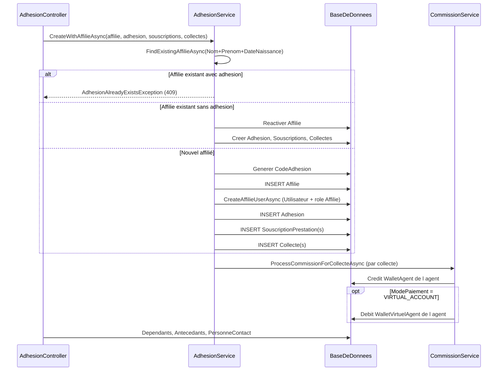
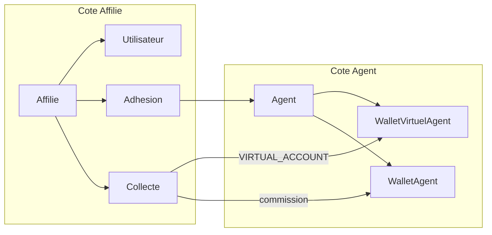

# Analyse : création de l'affilié pendant l'adhésion

Ce document décrit ce qui se passe réellement côté backend lors de la création d'un affilié pendant une adhésion, et clarifie le rôle des wallets (`WalletVirtuelAgent`, `WalletAgent`).

## 1) Réponse courte

**Non, l'affilié n'est pas créé avec un `WalletVirtuel`.**

Dans ProsocAPI :

- le wallet virtuel est un **`WalletVirtuelAgent`** lié à l'**Agent** (relation 1:1),
- l'**Affilié** n'a **aucun wallet** dans le modèle de données,
- lors de l'adhésion, l'affilié reçoit une identité métier + un compte applicatif, puis l'adhésion/collectes sont persistées.

Le wallet virtuel intervient uniquement si le paiement est en **`VIRTUAL_ACCOUNT`**, et c'est le wallet de **l'agent** qui est débité.

---

## 2) Endpoints concernés

| Endpoint | Rôle |
|---|---|
| `POST /api/Adhesion/with-affilie` | Flux synchrone terrain |
| `POST /api/Adhesion/with-affilie-multipart` | Même flux + fichiers (photo, carte d'identité) |
| `POST /api/Adhesion/with-affilie-paiement-electronique` | Initiation FlexPay ; création affilié/adhésion **après** paiement réussi |

Fichiers clés :

- [`Controllers/AdhesionController.cs`](Controllers/AdhesionController.cs)
- [`Services/AdhesionService.cs`](Services/AdhesionService.cs) → `CreateWithAffilieAsync`
- [`Services/CommissionService.cs`](Services/CommissionService.cs)
- [`Services/AgentService.cs`](Services/AgentService.cs) → `CreateAssociatedWalletVirtuelAsync`

---

## 3) Propriété des wallets (Agent vs Affilié)

### Modèle `Affilie`

Le modèle [`Models/Core/Affilie.cs`](Models/Core/Affilie.cs) expose :

- `Adhesion`, `Collectes`, `Souscriptions`, `Dependants`, `Antecedants`, `PersonneContact`
- **aucune** navigation vers un wallet

### Modèle `WalletVirtuelAgent`

Le modèle [`Models/Core/WalletVirtuelAgent.cs`](Models/Core/WalletVirtuelAgent.cs) est explicitement lié à un agent :

```csharp
public int AgentId { get; set; }
public virtual Agent Agent { get; set; } = null!;
```

### Création automatique du wallet virtuel

Le wallet virtuel est créé **à la création d'un agent**, pas à la création d'un affilié :

- méthode : `AgentService.CreateAssociatedWalletVirtuelAsync`
- conditions :
  - devise principale active trouvée,
  - aucun `WalletVirtuelAgent` existant pour cet agent
- valeurs initiales :
  - `SoldeVirtuel = 0`
  - `DeviseId = devise principale`
  - `Statut = true`

### Wallet de commission (`WalletAgent`)

Le `WalletAgent` appartient aussi à l'agent. Il n'est pas créé à l'adhésion de l'affilié, mais **à la volée** lors du commissionnement via `WalletAgentService.GetOrCreateForAgentAndDeviseAsync`.

---

## 4) Flux `CreateWithAffilieAsync`



### 4.1 Déduplication affilié

`FindExistingAffilieAsync` cherche un affilié par :

- `Nom` (normalisé trim + uppercase)
- `Prenom` (normalisé trim + uppercase)
- `DateNaissance` (date)

Cas :

| Situation | Comportement |
|---|---|
| Affilié trouvé + adhésion existante | `409 AdhesionAlreadyExistsException` |
| Affilié trouvé + pas d'adhésion | réutilisation affilié (réactivation `Statut=true`) |
| Affilié non trouvé | création d'un nouvel affilié |

### 4.2 Nouvel affilié : entités créées

Pour un nouvel affilié, `CreateWithAffilieAsync` crée dans cet ordre :

1. **`Affilie`**
   - génération `CodeAdhesion` (type adhésion + province)
   - calcul `NomComplet`
2. **`Utilisateur`** (si absent) via `CreateAffilieUserAsync`
   - `DefaultUsername = CodeAdhesion`
   - mot de passe par défaut `123456` (hashé)
   - `DoitChangerMotDePasse = true`
   - rôle `Affilié` (`AF`) via `UserRole`
3. **`Adhesion`**
   - lien `AffilieId`, `AgentId`, `TypeAdhesionId`
4. **`SouscriptionPrestation`** (selon collectes de type `Souscription`)
5. **`Collecte(s)`**
   - snapshot multidevise appliqué avant insertion

### 4.3 Post-traitement controller (hors service)

Après `CreateWithAffilieAsync`, le controller peut encore créer :

- dépendants (`CreateDependantsAsync`)
- antécédents
- personne contact (optionnel)
- envoi email de confirmation (non bloquant)

---

## 5) Tableau : ce qui est créé pour qui

| Entité | Créée à l'adhésion ? | Propriétaire / rattachement |
|---|---|---|
| `Affilie` | Oui (ou réutilisée) | — |
| `Utilisateur` | Oui (si absent) | Affilié (`AffilieId`) |
| `Adhesion` | Oui | Affilié |
| `SouscriptionPrestation` | Oui (selon collectes) | Affilié |
| `Collecte` | Oui | Affilié (+ `AgentId` si terrain) |
| `WalletVirtuelAgent` | **Non** | **Agent** |
| `WalletAgent` | Non directement ; lazy create à la commission | **Agent** |

---

## 6) Rôle du wallet virtuel (`VIRTUAL_ACCOUNT`)

Le wallet virtuel n'est **pas** un wallet affilié. C'est un mécanisme de perception de l'agent.

### 6.1 Modes de paiement par endpoint

| Endpoint | Modes acceptés |
|---|---|
| `with-affilie` | `ESPECE`, `VIREMENT_BANCAIRE`, `CHEQUE`, `VIRTUAL_ACCOUNT` |
| `with-affilie-paiement-electronique` | `MOBILE_MONEY`, `CARTE_BANCAIRE` (FlexPay) |

`with-affilie` rejette `MOBILE_MONEY` / `CARTE_BANCAIRE` (orientation vers FlexPay).

### 6.2 Validation avant commit (controller)

Dans `AdhesionController.ValidateAdhesionCollectesMultideviseAsync` :

1. pour chaque collecte en `VIRTUAL_ACCOUNT` :
   - récupération du `WalletVirtuelAgent` actif de l'agent (`AgentId`)
   - calcul du montant total à débiter (conversion multidevise incluse)
2. si wallet absent → erreur métier `BUSINESS_WALLET_VIRTUEL_INEXISTANT` (`400`)
3. si solde insuffisant → erreur métier `BUSINESS_SOLDE_INSUFFISANT` (`400`)

### 6.3 Débit après sauvegarde (commission)

Dans `CommissionService.ProcessCommissionAsync` :

1. crédit du `WalletAgent` de l'agent (commission)
2. si `ModePaiement = VIRTUAL_ACCOUNT` (ou alias `COMPTE VIRTUEL`) :
   - appel `ProcessWalletVirtuelAsync`
   - débit via `WalletVirtuelPaymentService.DebitAsync(collecte, adhesion.AgentId)`

Important : le débit cible **`adhesion.AgentId`**, jamais l'affilié.

### 6.4 Schéma wallet pendant adhésion terrain



---

## 7) Cas particuliers

### Adhésion en ligne FlexPay (sans agent terrain)

- `Adhesion.AgentId` peut être `null`
- conséquence :
  - pas de crédit commission agent
  - pas de débit wallet virtuel
  - traitement arriérés/pénalités peut quand même s'exécuter

### Affilié réutilisé

- pas de nouveau `Utilisateur` si un compte existe déjà pour `AffilieId`
- adhésion/collectes créées sur l'affilié existant

### Échec commission

- `ProcessCommissionForCollecteAsync` journalise l'erreur
- l'adhésion déjà persistée n'est pas annulée automatiquement pour autant

### Endpoint standalone affilié

- `POST /api/Affilie` (CRUD affilié) est un flux séparé
- il n'est **pas** utilisé par `with-affilie`

---

## 8) Conclusion opérationnelle

L'intuition « l'affilié est créé avec un WalletVirtuel » ne correspond pas au modèle actuel :

- l'affilié reçoit une identité métier (`Affilie`) + un accès applicatif (`Utilisateur`),
- le wallet virtuel est un outil de perception de l'agent,
- les mouvements wallet lors de l'adhésion concernent l'agent (commission + éventuel débit virtuel), pas l'affilié.

Pour l'intégration frontend :

- ne pas attendre de champ/solde wallet côté affilié à la création,
- en `VIRTUAL_ACCOUNT`, vérifier côté agent :
  - existence d'un wallet virtuel actif,
  - solde suffisant avant soumission,
  - gestion des erreurs `400` `BUSINESS_WALLET_VIRTUEL_INEXISTANT` et `BUSINESS_SOLDE_INSUFFISANT`.

---

## 9) Références code

| Sujet | Fichier | Méthode |
|---|---|---|
| Création affilié + adhésion | `Services/AdhesionService.cs` | `CreateWithAffilieAsync` |
| Déduplication affilié | `Services/AdhesionService.cs` | `FindExistingAffilieAsync` |
| Compte utilisateur affilié | `Services/AdhesionService.cs` | `CreateAffilieUserAsync` |
| Validation wallet virtuel avant commit | `Controllers/AdhesionController.cs` | `ValidateAdhesionCollectesMultideviseAsync` |
| Commission + débit virtuel | `Services/CommissionService.cs` | `ProcessCommissionAsync`, `ProcessWalletVirtuelAsync` |
| Création wallet virtuel agent | `Services/AgentService.cs` | `CreateAssociatedWalletVirtuelAsync` |
| Détection mode virtuel | `Utilities/CollecteAdhesionHelper.cs` | `IsVirtualAccountPayment` |
