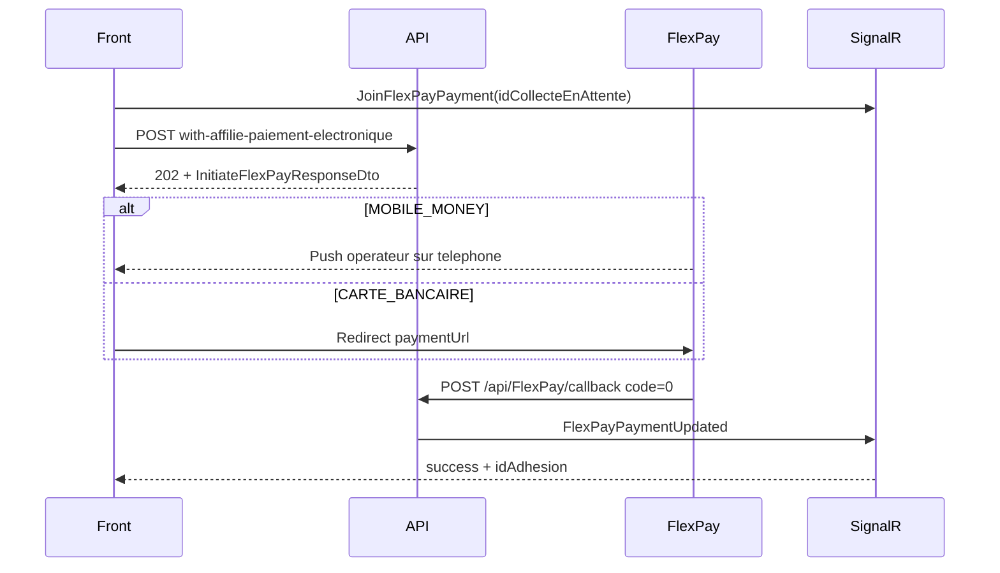

# Frontend Integration - Adhesion FlexPay

Ce document guide l'integration frontend de l'endpoint d'adhesion en ligne avec paiement electronique (FlexPay).

Endpoint cible : `POST /api/Adhesion/with-affilie-paiement-electronique`

## 1) Vue d'ensemble du flux

Cet endpoint est **asynchrone** : aucun affilié, adhésion ni collecte n'est cree en base avant confirmation du paiement par FlexPay.



Points cles :

- Reponse **`202 Accepted`** (pas `200` ni `201`) — le `202` signifie **initiation reussie**, pas adhesion finalisee.
- Endpoint **public** (`[AllowAnonymous]`) — pas de JWT requis pour l'adhesion en ligne.
- `POST /api/Adhesion/with-affilie` **rejette** `MOBILE_MONEY` et `CARTE_BANCAIRE` avec `400` et oriente vers cet endpoint.
- L'affilie, l'adhesion, les souscriptions et les collectes sont crees **uniquement** au callback FlexPay succes (`code = "0"`).

## 2) Endpoint et auth

| Champ | Valeur |
|-------|--------|
| Methode | `POST` |
| URL | `/api/Adhesion/with-affilie-paiement-electronique` |
| Auth | Aucune (public) |
| Content-Type | `application/json` |
| Reponse succes | `202 Accepted` + `InitiateFlexPayResponseDto` |

Notes auth :

- Si un JWT est present (ex. encodeur connecte), l'API peut enregistrer l'operateur via `TryGetCurrentUserId()`.
- Pour l'adhesion en ligne self-service, appeler sans token.

## 3) Structure du payload request

Type racine : `AdhesionWithAffiliePaiementElectroniqueCreateDto`

### 3.1 Champs racine

| Champ | Obligatoire | Description |
|-------|-------------|-------------|
| `modePaiement` | Oui | `MOBILE_MONEY` ou `CARTE_BANCAIRE` (alias acceptes : `CARTE`, `CARD` pour carte) |
| `telephonePaiement` | Oui si MM | Numero du compte Mobile Money |
| `devisePaiementId` | Oui | ID devise (`CDF` ou `USD`) — doit etre identique sur toutes les collectes |
| `adhesion` | Oui | Objet `AdhesionWithAffilieCreateDto` |

Le serveur **normalise** `modePaiement` et `deviseId` sur chaque ligne de `adhesion.collectes[]` a partir des valeurs racine.

### 3.2 Objet `adhesion` (AdhesionWithAffilieCreateDto)

**Identite affilié**

| Champ | Obligatoire | Description |
|-------|-------------|-------------|
| `nom` | Oui | |
| `prenom` | Oui | |
| `postnom` | Non | |
| `dateNaissance` | Oui | Format ISO date |
| `telephone` | Non | Telephone de contact affilié |
| `emailAffilie` | Non | |

**Adresse residence**

| Champ | Obligatoire |
|-------|-------------|
| `provinceResidence` | Oui |
| `communeResidence` | Non |
| `quartierResidence` | Non |
| `avenueResidence` | Non |
| `numeroResidence` | Non |

**Adresse activite** (optionnel) : `communeActivite`, `quartierActivite`, `avenueActivite`, `numeroActivite`

**Fichiers** (base64) : `photoBase64`, `photoContentType`, `carteIdentiteBase64`, `carteIdentiteContentType`

**Adhesion**

| Champ | Obligatoire | Description |
|-------|-------------|-------------|
| `statutDossier` | Oui | Ex. `"EN ATTENTE"` |
| `typeAdhesionId` | Oui | ID type adhesion |
| `adhesionStatut` | Non | Defaut `true` |
| `affilieStatut` | Non | Defaut `true` |
| `agentId` | Non | **Omettre ou `null`** pour adhesion en ligne — `Adhesion.AgentId` reste `null` jusqu'a affectation admin |
| `collectes` | Oui | Au moins 1 element |

**Optionnels** : `dependants[]`, `antecedants[]`, `personneContact`

### 3.3 Objet `collectes[]` (CollecteAvecSouscriptionDto)

| Champ | Obligatoire | Description |
|-------|-------------|-------------|
| `typeCollecte` | Oui | `Frais` (1), `Souscription` (2), `Cotisation` (3) |
| `montant` | Oui | Doit correspondre au tarif serveur (paiement partiel interdit) |
| `deviseId` | Oui | Meme devise sur toutes les lignes |
| `modePaiement` | Oui | `MOBILE_MONEY` ou `CARTE_BANCAIRE` (ecrase par le serveur) |
| `mois` | Non | Defaut mois courant |
| `annee` | Non | Defaut annee courante |
| `statutPaiement` | Non | `"EN_ATTENTE"` accepte a l'initiation |
| `fraisId` | Si `Frais` | |
| `cotisationAffilieId` | Si `Cotisation` | |
| `souscription.prestationId` | Si `Souscription` | |

Regles metier collectes :

- **Toutes** les collectes doivent etre FlexPay (`MOBILE_MONEY` ou `CARTE_BANCAIRE`).
- **Une seule** methode FlexPay par adhesion (pas de melange MM + CB).
- **Une seule** transaction FlexPay pour le **montant total** (pas de paiement partiel).
- **Une seule** devise de paiement (`CDF` ou `USD`) sur toutes les lignes.
- `referencePaiement` : non requis a l'initiation (genere au callback).
- En multidevise, le serveur convertit les montants (ex. frais USD → CDF selon taux du jour).

### 3.4 Exemple minimal (cotisation + souscription)

`POST /api/Adhesion/with-affilie-paiement-electronique`

```json
{
  "modePaiement": "MOBILE_MONEY",
  "telephonePaiement": "0822222222",
  "devisePaiementId": 1,
  "adhesion": {
    "nom": "Mukendi",
    "prenom": "Grace",
    "dateNaissance": "1992-04-05",
    "telephone": "0822222222",
    "provinceResidence": "Kinshasa",
    "communeResidence": "Gombe",
    "quartierResidence": "Centre",
    "photoBase64": "cGhvdG8=",
    "photoContentType": "image/jpeg",
    "carteIdentiteBase64": "Y2FydGU=",
    "carteIdentiteContentType": "image/jpeg",
    "affilieStatut": true,
    "statutDossier": "EN ATTENTE",
    "typeAdhesionId": 1,
    "agentId": null,
    "adhesionStatut": true,
    "collectes": [
      {
        "typeCollecte": "Cotisation",
        "cotisationAffilieId": 1,
        "montant": 1.5,
        "deviseId": 1,
        "modePaiement": "MOBILE_MONEY",
        "statutPaiement": "EN_ATTENTE",
        "mois": 7,
        "annee": 2026
      },
      {
        "typeCollecte": "Souscription",
        "montant": 50,
        "deviseId": 1,
        "modePaiement": "MOBILE_MONEY",
        "statutPaiement": "EN_ATTENTE",
        "mois": 7,
        "annee": 2026,
        "souscription": {
          "prestationId": 12,
          "statut": true
        }
      }
    ]
  }
}
```

### 3.5 Exemple complet (dependants, antecedants, personne contact)

```json
{
  "modePaiement": "CARTE_BANCAIRE",
  "devisePaiementId": 2,
  "adhesion": {
    "nom": "Kabila",
    "prenom": "Marie",
    "postnom": "Nzuzi",
    "dateNaissance": "1988-11-20",
    "telephone": "0812345678",
    "emailAffilie": "marie.kabila@example.com",
    "provinceResidence": "Kinshasa",
    "communeResidence": "Limete",
    "quartierResidence": "Industriel",
    "photoBase64": "cGhvdG8=",
    "photoContentType": "image/jpeg",
    "carteIdentiteBase64": "Y2FydGU=",
    "carteIdentiteContentType": "image/jpeg",
    "statutDossier": "EN ATTENTE",
    "typeAdhesionId": 2,
    "adhesionStatut": true,
    "affilieStatut": true,
    "collectes": [
      {
        "typeCollecte": "Frais",
        "fraisId": 1,
        "montant": 25,
        "deviseId": 2,
        "modePaiement": "CARTE_BANCAIRE",
        "statutPaiement": "EN_ATTENTE"
      },
      {
        "typeCollecte": "Cotisation",
        "cotisationAffilieId": 1,
        "montant": 1.5,
        "deviseId": 2,
        "modePaiement": "CARTE_BANCAIRE",
        "statutPaiement": "EN_ATTENTE",
        "mois": 7,
        "annee": 2026
      }
    ],
    "dependants": [
      {
        "nom": "Kabila Enfant",
        "lienParente": "Enfant",
        "dateNaissance": "2015-03-10",
        "adresse": "Limete, Kinshasa"
      }
    ],
    "antecedants": [
      {
        "description": "Hypertension",
        "statut": true
      }
    ],
    "personneContact": {
      "nomComplet": "Jean Kabila",
      "lienParente": "Epoux",
      "adresse": "Limete, Kinshasa"
    }
  }
}
```

Notes exemple complet :

- `CARTE_BANCAIRE` : `telephonePaiement` non requis.
- Les montants doivent correspondre aux tarifs calcules cote serveur (selon `typeAdhesionId`, nombre de dependants, devise).
- `affilieId` dans `dependants` / `antecedants` : optionnel a la creation (l'affilie n'existe pas encore).

## 4) Reponse `202 Accepted`

Type : `InitiateFlexPayResponseDto`

```json
{
  "idCollecteEnAttente": "a3cd855a-7804-4216-8a67-4648f6c48d66",
  "orderNumberFlexPay": "ORD-20260707-001",
  "referenceFlexPay": "AD-a3cd855a78044216",
  "montantTarif": 51.5,
  "codeDeviseTarif": "USD",
  "montantFlexPay": 51.5,
  "codeDevisePaiement": "USD",
  "tauxApplique": 1,
  "holdExpireAt": "2026-07-07T14:12:00Z",
  "paymentUrl": null,
  "flexPayAccepted": true,
  "message": "Adhesion en attente — validez le paiement Mobile Money."
}
```

Exemple carte bancaire (`paymentUrl` renseigne) :

```json
{
  "idCollecteEnAttente": "00d47c42-fca5-40c9-a175-b1899c6ec7c5",
  "orderNumberFlexPay": "ORD-20260707-002",
  "referenceFlexPay": "AD-00d47c42fca540c9",
  "montantTarif": 26.5,
  "codeDeviseTarif": "USD",
  "montantFlexPay": 26.5,
  "codeDevisePaiement": "USD",
  "tauxApplique": 1,
  "holdExpireAt": "2026-07-07T14:12:00Z",
  "paymentUrl": "https://cardpayment.flexpay.cd/v1/checkout/...",
  "flexPayAccepted": true,
  "message": "Adhesion en attente — redirigez vers l'URL de paiement carte."
}
```

Champs UX importants :

| Champ | Usage frontend |
|-------|----------------|
| `idCollecteEnAttente` | Connexion SignalR (`JoinFlexPayPayment`) et suivi |
| `orderNumberFlexPay` | Reference transaction (fallback staff : `GET /api/FlexPay/verifier/{orderNumber}`) |
| `montantFlexPay` | Montant exact a payer (arrondi entier si `CDF`) |
| `holdExpireAt` | Compte a rebours — hold de 15 min par defaut |
| `paymentUrl` | **Obligatoire** pour `CARTE_BANCAIRE` — redirection navigateur |
| `flexPayAccepted` | `true` si FlexPay a accepte l'initiation |
| `message` | Texte a afficher a l'utilisateur |

## 5) Comportement post-paiement (cote frontend)

### 5.1 Ce que le frontend ne doit PAS faire

- **Ne pas appeler** `POST /api/FlexPay/callback` — c'est le webhook FlexPay qui le fait.
- **Ne pas considerer** le `202` comme adhesion creee — attendre `FlexPayPaymentUpdated` ou timeout.

### 5.2 SignalR (recommande)

Hub : `{apiBaseUrl}/flexPayHub` (pas de JWT requis).

**Ordre recommande** :

1. Preparer le payload adhesion.
2. Connecter SignalR et s'abonner a `FlexPayPaymentUpdated`.
3. Appeler `POST /api/Adhesion/with-affilie-paiement-electronique`.
4. Avec la reponse `202`, appeler `JoinFlexPayPayment(idCollecteEnAttente)`.
5. Selon le mode :
   - **MOBILE_MONEY** : afficher ecran d'attente + inviter l'utilisateur a valider le push operateur.
   - **CARTE_BANCAIRE** : rediriger vers `paymentUrl`.
6. A la reception de `FlexPayPaymentUpdated` :
   - `success === true` ou `alreadyProcessed === true` → lire `idAdhesion`, rediriger vers confirmation.
   - `failed === true` → afficher echec paiement.
   - Sinon → afficher `message` (erreur metier).

Payload SignalR (`FlexPayPaymentUpdatedDto`) :

```json
{
  "idCollecteEnAttente": "a3cd855a-7804-4216-8a67-4648f6c48d66",
  "orderNumberFlexPay": "ORD-20260707-001",
  "referenceFlexPay": "AD-a3cd855a78044216",
  "success": true,
  "alreadyProcessed": false,
  "failed": false,
  "codeFlexPay": "0",
  "message": "Adhesion 42 creee.",
  "sourceFlux": "AdhesionWithAffilie",
  "idAdhesion": 42,
  "idCollecte": 123,
  "timestampUtc": "2026-07-07T14:05:00Z"
}
```

### 5.3 Exemple client SignalR (TypeScript)

```typescript
import * as signalR from "@microsoft/signalr";

export interface AdhesionWithAffiliePaiementElectroniqueCreateDto {
  modePaiement: "MOBILE_MONEY" | "CARTE_BANCAIRE";
  telephonePaiement?: string;
  devisePaiementId: number;
  adhesion: AdhesionWithAffilieCreateDto; // voir Models/DTOs/Core/AdhesionDtos.cs
}

export interface InitiateFlexPayResponseDto {
  idCollecteEnAttente: string;
  orderNumberFlexPay?: string;
  referenceFlexPay: string;
  montantTarif: number;
  codeDeviseTarif: string;
  montantFlexPay: number;
  codeDevisePaiement: string;
  tauxApplique?: number;
  holdExpireAt: string;
  paymentUrl?: string;
  flexPayAccepted: boolean;
  message: string;
}

export interface FlexPayPaymentUpdatedDto {
  idCollecteEnAttente: string;
  orderNumberFlexPay?: string;
  referenceFlexPay?: string;
  success: boolean;
  alreadyProcessed: boolean;
  failed: boolean;
  codeFlexPay?: string;
  message: string;
  sourceFlux: string;
  idAdhesion?: number;
  idCollecte?: number;
  timestampUtc: string;
}

export async function initierAdhesionFlexPay(
  apiBase: string,
  payload: AdhesionWithAffiliePaiementElectroniqueCreateDto,
  onPaymentUpdated: (event: FlexPayPaymentUpdatedDto) => void
): Promise<InitiateFlexPayResponseDto> {
  const connection = new signalR.HubConnectionBuilder()
    .withUrl(`${apiBase}/flexPayHub`)
    .withAutomaticReconnect()
    .build();

  connection.on("FlexPayPaymentUpdated", onPaymentUpdated);
  await connection.start();

  const res = await fetch(`${apiBase}/api/Adhesion/with-affilie-paiement-electronique`, {
    method: "POST",
    headers: { "Content-Type": "application/json" },
    body: JSON.stringify(payload),
  });

  if (res.status !== 202) {
    const err = await res.text();
    throw new Error(`Initiation FlexPay echouee (${res.status}): ${err}`);
  }

  const init = (await res.json()) as InitiateFlexPayResponseDto;
  await connection.invoke("JoinFlexPayPayment", init.idCollecteEnAttente);

  if (payload.modePaiement === "CARTE_BANCAIRE" && init.paymentUrl) {
    window.location.href = init.paymentUrl;
  }

  return init;
}
```

### 5.4 Fallback / poll `verifier`

`GET /api/FlexPay/verifier/{orderNumber}` — secours si SignalR indisponible.

Interprétation de la réponse :

- **`pending: true`** → paiement encore en confirmation chez FlexPay ; **continuer le poll** (ce n’est pas un refus).
- **`success: true`** avec `idAdhesion` / `idCollecte` (ou `alreadyProcessed`) → succès, écran de confirmation.
- Ne pas traiter un poll précoce comme « Paiement refusé » : seuls le callback FlexPay `code != "0"` ou un SignalR `failed` sont un échec définitif.

### 5.5 Apres succes adhesion

Cote serveur (automatique au callback) :

- Creation affilié + adhesion + collectes + souscriptions.
- Creation compte utilisateur affilié (mot de passe temporaire, `doitChangerMotDePasse: true`).
- `Adhesion.AgentId` reste `null` jusqu'a affectation d'un gestionnaire AT par un admin.

Cote frontend :

- Rediriger vers ecran de confirmation avec `idAdhesion` (recupere via SignalR).
- Proposer connexion / changement de mot de passe.
- Informer que l'affectation d'un gestionnaire AT peut prendre du delai.

## 6) Differences avec `POST /api/Adhesion/with-affilie`

| Aspect | `with-affilie` | `with-affilie-paiement-electronique` |
|--------|----------------|--------------------------------------|
| Modes paiement | `ESPECE`, `VIREMENT_BANCAIRE`, `CHEQUE`, `VIRTUAL_ACCOUNT` | `MOBILE_MONEY`, `CARTE_BANCAIRE` |
| Code HTTP succes | `200` + `AdhesionWithAffilieReadDto` | `202` + `InitiateFlexPayResponseDto` |
| `agentId` | Obligatoire (adhesion terrain) | `null` ou omis (adhesion en ligne) |
| Creation entites | Immediate | Au callback FlexPay uniquement |
| Format | JSON ou multipart (`with-affilie` multipart) | JSON uniquement |
| Validations terrain | Photo, piece identite, agent AT, etc. | Validations FlexPay + tarifs collectes |

Regle de routage frontend :

```
if (modePaiement === "MOBILE_MONEY" || modePaiement === "CARTE_BANCAIRE") {
  → POST /api/Adhesion/with-affilie-paiement-electronique
} else {
  → POST /api/Adhesion/with-affilie  (agentId obligatoire)
}
```

## 7) Erreurs courantes (`400`)

| Message / cause | Action frontend |
|-----------------|-----------------|
| `Le payload d'adhesion est obligatoire.` | Verifier `adhesion` non null |
| `ModePaiement invalide pour cet endpoint...` | Utiliser `MOBILE_MONEY` ou `CARTE_BANCAIRE` |
| `Au moins une collecte est requise.` | Ajouter `adhesion.collectes[]` |
| `TelephonePaiement est obligatoire pour MOBILE_MONEY.` | Renseigner `telephonePaiement` |
| `Toutes les collectes doivent utiliser MOBILE_MONEY ou CARTE_BANCAIRE...` | Uniformiser les modes collectes |
| `DevisePaiementId doit correspondre a l'unique devise...` | Aligner `devisePaiementId` et `collectes[].deviseId` |
| `Paiement partiel interdit : montant attendu X, recu Y...` | Recalculer montants selon tarifs API |
| `Le paiement electronique FlexPay n'est pas active.` | Desactiver le flux ou contacter admin |
| `Mobile Money FlexPay desactive.` / `Carte bancaire FlexPay desactivee.` | Proposer autre mode ou contacter admin |
| `Le numero de telephone est requis pour MOBILE_MONEY.` | Renseigner telephone (service interne) |
| Hold actif (doublon telephone, ~15 min) | Afficher message + proposer nouvelle tentative apres expiration |
| `FlexPay a refuse l'initiation du paiement.` | Afficher `message` FlexPay, permettre retry |
| Sur `with-affilie` : `...with-affilie-paiement-electronique` | Router vers le bon endpoint |

## 8) Checklist frontend

- [ ] Router `MOBILE_MONEY` / `CARTE_BANCAIRE` vers `with-affilie-paiement-electronique`
- [ ] Router les autres modes vers `with-affilie` (avec `agentId` terrain)
- [ ] Calculer les montants collectes en s'alignant sur les tarifs API (type adhesion + nb dependants + devise)
- [ ] Envoyer `devisePaiementId` coherent avec toutes les collectes
- [ ] Gerer MM (ecran attente push) vs CB (redirect `paymentUrl`)
- [ ] Connecter SignalR **avant** ou **juste apres** le POST, puis `JoinFlexPayPayment`
- [ ] Ecouter `FlexPayPaymentUpdated` et lire `idAdhesion` au succes
- [ ] Afficher compte a rebours base sur `holdExpireAt`
- [ ] Gerer echec, timeout et hold expire (nouvelle tentative possible)
- [ ] Ne pas traiter `202` comme adhesion finalisee
- [ ] Types TypeScript a creer/mettre a jour :
  - `AdhesionWithAffiliePaiementElectroniqueCreateDto`
  - `AdhesionWithAffilieCreateDto`
  - `CollecteAvecSouscriptionDto`
  - `InitiateFlexPayResponseDto`
  - `FlexPayPaymentUpdatedDto`
- [ ] Ecran post-succes : confirmation + login / changement mot de passe
- [ ] Pour adhesion en ligne : ne pas exiger `agentId`

## 9) References

- Controller : `Controllers/AdhesionController.cs` — `CreateWithAffiliePaiementElectronique`
- Service initiation : `Services/FlexPayAdhesionService.cs`
- DTOs : `Models/DTOs/Core/AdhesionDtos.cs`, `Models/DTOs/FlexPay/FlexPayDtos.cs`, `Models/DTOs/FlexPay/FlexPayRealtimeDtos.cs`
- Hub SignalR : `Hubs/FlexPayHub.cs` — endpoint `/flexPayHub`
- Tests integration : `Prosoc.Tests.Integration/FlexPay/FlexPayCallbackIntegrationTests.cs`
  - `AdhesionFlexPay_InitiationPuisCallback_CreeAdhesion`
  - `AdhesionCarteBancaire_InitiationPuisCallback_CreeAdhesion`
  - `AdhesionFlexPayEndpoint_RequiresPhoneForMobileMoney`
  - `AdhesionEndpoint_WithAffilie_RejectsFlexPayModes`
- Doc API detaillee : `API-DOCUMENTATION-NEW.md` — sections FlexPay et Adhesion FlexPay

Commande tests :

```bash
dotnet test Prosoc.Tests.Integration/Prosoc.Tests.Integration.csproj --filter "FullyQualifiedName~FlexPay"
```
