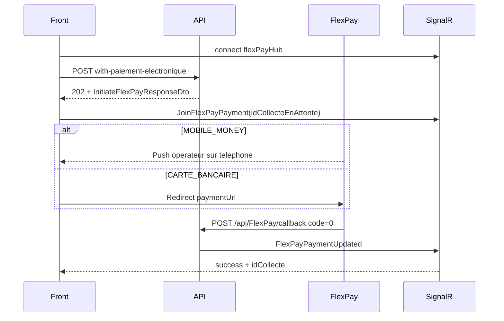

# Frontend Integration - Collecte FlexPay

Ce document guide l'integration frontend de l'endpoint de paiement electronique public pour une **collecte unique** (FlexPay).

Endpoint cible : `POST /api/Collecte/with-paiement-electronique`

Voir aussi : [`FRONTEND_INTEGRATION_ADHESION_FLEXPAY.md`](FRONTEND_INTEGRATION_ADHESION_FLEXPAY.md) pour le flux adhesion en ligne (meme infrastructure SignalR / FlexPay).

Pour l'**achat d'une nouvelle prestation** (creation souscription + premiere collecte) via FlexPay : `POST /api/SouscriptionPrestation/paiement-electronique` (JWT, reponse `202`, meme hub SignalR). Detail API : section FlexPay dans `API-DOCUMENTATION-NEW.md`.

## 1) Vue d'ensemble du flux

Cet endpoint est **asynchrone** : la collecte n'est **pas** creee en base avant confirmation du paiement par FlexPay.

Cas d'usage : paiement public (app mobile, portail) pour un **affilie existant** — frais, cotisation ou souscription.



Points cles :

- Reponse **`202 Accepted`** (pas `200` ni `201`) — initiation reussie, collecte **non** finalisee.
- Endpoint **public** (`[AllowAnonymous]`) — pas de JWT requis.
- **Une seule** collecte par appel (pas de tableau `collectes[]`).
- `affilieId` et `agentId` **obligatoires** dans `collecte` (affilie deja en base).
- Reference FlexPay prefixe `PS-` (vs `AD-` pour adhesion).
- Succès SignalR → `idCollecte` (pas `idAdhesion`).
- `sourceFlux` = `CollectePaiementElectroniquePublic`.

## 2) Endpoint et auth

| Champ | Valeur |
|-------|--------|
| Methode | `POST` |
| URL | `/api/Collecte/with-paiement-electronique` |
| Auth | Aucune (public) |
| Content-Type | `application/json` |
| Reponse succes | `202 Accepted` + `InitiateFlexPayResponseDto` |

Notes auth :

- Le controller `CollecteController` est `[Authorize]` par defaut, mais cette action est `[AllowAnonymous]`.
- Si un JWT est present, l'operateur peut etre enregistre via `CurrentUserResolver` (optionnel).
- Pour un paiement public self-service, appeler **sans token**.

## 3) Structure du payload request

Type racine : `CollecteWithPaiementElectroniqueCreateDto`

### 3.1 Champs racine

| Champ | Obligatoire | Description |
|-------|-------------|-------------|
| `modePaiement` | Oui | `MOBILE_MONEY` ou `CARTE_BANCAIRE` (alias : `CARTE`, `CARD`) |
| `telephonePaiement` | Oui si MM | Numero du compte Mobile Money |
| `devisePaiementId` | Oui | ID devise (`CDF` ou `USD`) — doit egaler `collecte.deviseId` |
| `collecte` | Oui | Objet `CollecteCreateDto` |

Le serveur **normalise** `modePaiement`, `deviseId` et `phone` sur `collecte` a partir des valeurs racine.

### 3.2 Objet `collecte` (CollecteCreateDto)

| Champ | Obligatoire | Description |
|-------|-------------|-------------|
| `typeCollecte` | Oui | `Frais` (1), `Souscription` (2), `Cotisation` (3) |
| `affilieId` | Oui | Affilie existant en base |
| `agentId` | Oui | Agent parrainage / guichet |
| `montant` | Oui | Doit correspondre au tarif serveur |
| `deviseId` | Oui | Meme valeur que `devisePaiementId` |
| `modePaiement` | Oui | Ecrase par `modePaiement` racine |
| `fraisId` | Si `Frais` | Requis, pas de `cotisationAffilieId` ni `souscriptionPrestationId` |
| `cotisationAffilieId` | Si `Cotisation` | Requis, adhésion affilié necessaire |
| `souscriptionPrestationId` | Si `Souscription` | Requis, validation eligibilite produit |
| `mois` | Non | Defaut mois courant |
| `annee` | Non | Defaut annee courante |
| `statutPaiement` | Non | Defaut `EN_ATTENTE` si omis |
| `referencePaiement` | Non | Genere au callback |
| `observation` | Non | |
| `statut` | Non | Defaut `true` |

Regles metier :

- Validation structure `IsValid()` selon `typeCollecte` (un seul ID metier par type).
- **Paiement partiel interdit** : `montant` doit correspondre au tarif calcule serveur (tolérance `FlexPay:MontantTolerance`, defaut 0.05).
- Hold anti-doublon (~15 min) sur cle `affilieId + typeCollecte + mois + annee + fraisId/souscriptionId/cotisationId`.
- Cotisation : validation adhésion affilié + nombre de dependants.
- Souscription : validation eligibilite produit (`ProduitEligibiliteRules`).
- Devise paiement : `CDF` ou `USD` uniquement.

### 3.3 Exemple minimal (Frais — Mobile Money)

`POST /api/Collecte/with-paiement-electronique`

```json
{
  "modePaiement": "MOBILE_MONEY",
  "telephonePaiement": "0822222222",
  "devisePaiementId": 1,
  "collecte": {
    "typeCollecte": "Frais",
    "fraisId": 1,
    "affilieId": 42,
    "agentId": 1,
    "montant": 1500,
    "mois": 7,
    "annee": 2026,
    "deviseId": 1,
    "modePaiement": "MOBILE_MONEY",
    "statutPaiement": "EN_ATTENTE",
    "statut": true
  }
}
```

Notes :

- `montant` doit correspondre au tarif du frais (eventuellement converti si multidevise).
- Avant le callback, **aucune** ligne dans `Collectes` — seulement `CollectesEnAttente`.

### 3.4 Exemple complet (Cotisation)

```json
{
  "modePaiement": "MOBILE_MONEY",
  "telephonePaiement": "0812345678",
  "devisePaiementId": 2,
  "collecte": {
    "typeCollecte": "Cotisation",
    "cotisationAffilieId": 1,
    "affilieId": 42,
    "agentId": 3,
    "montant": 1.5,
    "mois": 7,
    "annee": 2026,
    "deviseId": 2,
    "modePaiement": "MOBILE_MONEY",
    "statutPaiement": "EN_ATTENTE",
    "observation": "Cotisation juillet 2026",
    "statut": true
  }
}
```

### 3.5 Exemple Souscription (Carte bancaire)

```json
{
  "modePaiement": "CARTE_BANCAIRE",
  "devisePaiementId": 1,
  "collecte": {
    "typeCollecte": "Souscription",
    "souscriptionPrestationId": 15,
    "affilieId": 42,
    "agentId": 3,
    "montant": 5000,
    "mois": 7,
    "annee": 2026,
    "deviseId": 1,
    "modePaiement": "CARTE_BANCAIRE",
    "statutPaiement": "EN_ATTENTE",
    "statut": true
  }
}
```

Notes :

- `CARTE_BANCAIRE` : `telephonePaiement` non requis.
- Reponse `202` doit contenir `paymentUrl` non vide pour redirection.

## 4) Reponse `202 Accepted`

Type : `InitiateFlexPayResponseDto` (identique au flux adhesion)

Exemple Mobile Money :

```json
{
  "idCollecteEnAttente": "56ecc1d5-1c0c-4691-97de-279cdd047be4",
  "orderNumberFlexPay": "ORD-20260707-101",
  "referenceFlexPay": "PS-56ecc1d51c0c4691",
  "montantTarif": 1500,
  "codeDeviseTarif": "CDF",
  "montantFlexPay": 1500,
  "codeDevisePaiement": "CDF",
  "tauxApplique": 1,
  "holdExpireAt": "2026-07-07T14:21:00Z",
  "paymentUrl": null,
  "flexPayAccepted": true,
  "message": "Validez le paiement sur votre telephone Mobile Money."
}
```

Exemple Carte bancaire :

```json
{
  "idCollecteEnAttente": "ef743a43-93c5-49cc-8b98-e3c29d0cbab0",
  "orderNumberFlexPay": "ORD-20260707-102",
  "referenceFlexPay": "PS-ef743a4393c549cc",
  "montantTarif": 1500,
  "codeDeviseTarif": "CDF",
  "montantFlexPay": 1500,
  "codeDevisePaiement": "CDF",
  "tauxApplique": 1,
  "holdExpireAt": "2026-07-07T14:21:00Z",
  "paymentUrl": "https://cardpayment.flexpay.cd/v1/checkout/...",
  "flexPayAccepted": true,
  "message": "Redirigez le client vers l'URL de paiement carte."
}
```

Champs UX importants :

| Champ | Usage frontend |
|-------|----------------|
| `idCollecteEnAttente` | `JoinFlexPayPayment` SignalR et suivi |
| `orderNumberFlexPay` | Reference transaction (fallback staff JWT) |
| `referenceFlexPay` | Prefixe `PS-` pour collecte |
| `montantFlexPay` | Montant exact a payer (arrondi entier si `CDF`) |
| `holdExpireAt` | Compte a rebours — hold 15 min par defaut |
| `paymentUrl` | **Obligatoire** pour `CARTE_BANCAIRE` |
| `flexPayAccepted` | `true` si FlexPay a accepte l'initiation |
| `message` | Texte a afficher a l'utilisateur |

## 5) Comportement post-paiement (cote frontend)

### 5.1 Ce que le frontend ne doit PAS faire

- **Ne pas appeler** `POST /api/FlexPay/callback` — webhook FlexPay uniquement.
- **Ne pas considerer** le `202` comme collecte creee — attendre `FlexPayPaymentUpdated` ou timeout.

### 5.2 SignalR (recommande)

Hub : `{apiBaseUrl}/flexPayHub` (pas de JWT requis).

**Ordre recommande** :

1. Preparer le payload collecte (`affilieId`, `agentId`, tarifs).
2. Connecter SignalR et s'abonner a `FlexPayPaymentUpdated`.
3. Appeler `POST /api/Collecte/with-paiement-electronique`.
4. Avec la reponse `202`, appeler `JoinFlexPayPayment(idCollecteEnAttente)`.
5. Selon le mode :
   - **MOBILE_MONEY** : ecran d'attente + validation push operateur.
   - **CARTE_BANCAIRE** : redirection vers `paymentUrl`.
6. A la reception de `FlexPayPaymentUpdated` :
   - `success === true` ou `alreadyProcessed === true` → lire `idCollecte`.
   - Verifier `sourceFlux === "CollectePaiementElectroniquePublic"`.
   - `failed === true` → afficher echec paiement.

Payload SignalR (`FlexPayPaymentUpdatedDto`) :

```json
{
  "idCollecteEnAttente": "56ecc1d5-1c0c-4691-97de-279cdd047be4",
  "orderNumberFlexPay": "ORD-20260707-101",
  "referenceFlexPay": "PS-56ecc1d51c0c4691",
  "success": true,
  "alreadyProcessed": false,
  "failed": false,
  "codeFlexPay": "0",
  "message": "Collecte 123 creee.",
  "sourceFlux": "CollectePaiementElectroniquePublic",
  "idAdhesion": null,
  "idCollecte": 123,
  "timestampUtc": "2026-07-07T14:08:00Z"
}
```

### 5.3 Exemple client SignalR (TypeScript)

```typescript
import * as signalR from "@microsoft/signalr";

export interface CollecteCreateDto {
  typeCollecte: "Frais" | "Souscription" | "Cotisation";
  affilieId: number;
  agentId: number;
  montant: number;
  deviseId: number;
  modePaiement: string;
  fraisId?: number;
  cotisationAffilieId?: number;
  souscriptionPrestationId?: number;
  mois?: number;
  annee?: number;
  statutPaiement?: string;
  observation?: string;
  statut?: boolean;
}

export interface CollecteWithPaiementElectroniqueCreateDto {
  modePaiement: "MOBILE_MONEY" | "CARTE_BANCAIRE";
  telephonePaiement?: string;
  devisePaiementId: number;
  collecte: CollecteCreateDto;
}

export interface InitiateFlexPayResponseDto {
  idCollecteEnAttente: string;
  orderNumberFlexPay?: string;
  referenceFlexPay: string;
  montantTarif: number;
  codeDeviseTarif: string;
  montantFlexPay: number;
  codeDevisePaiement: string;
  tauxApplique?: number;
  holdExpireAt: string;
  paymentUrl?: string;
  flexPayAccepted: boolean;
  message: string;
}

export interface FlexPayPaymentUpdatedDto {
  idCollecteEnAttente: string;
  orderNumberFlexPay?: string;
  referenceFlexPay?: string;
  success: boolean;
  alreadyProcessed: boolean;
  failed: boolean;
  codeFlexPay?: string;
  message: string;
  sourceFlux: string;
  idAdhesion?: number;
  idCollecte?: number;
  timestampUtc: string;
}

export async function initierCollecteFlexPay(
  apiBase: string,
  payload: CollecteWithPaiementElectroniqueCreateDto,
  onPaymentUpdated: (event: FlexPayPaymentUpdatedDto) => void
): Promise<InitiateFlexPayResponseDto> {
  const connection = new signalR.HubConnectionBuilder()
    .withUrl(`${apiBase}/flexPayHub`)
    .withAutomaticReconnect()
    .build();

  connection.on("FlexPayPaymentUpdated", (event: FlexPayPaymentUpdatedDto) => {
    if (event.sourceFlux === "CollectePaiementElectroniquePublic") {
      onPaymentUpdated(event);
    }
  });

  await connection.start();

  const res = await fetch(`${apiBase}/api/Collecte/with-paiement-electronique`, {
    method: "POST",
    headers: { "Content-Type": "application/json" },
    body: JSON.stringify(payload),
  });

  if (res.status !== 202) {
    const err = await res.text();
    throw new Error(`Initiation FlexPay echouee (${res.status}): ${err}`);
  }

  const init = (await res.json()) as InitiateFlexPayResponseDto;
  await connection.invoke("JoinFlexPayPayment", init.idCollecteEnAttente);

  if (payload.modePaiement === "CARTE_BANCAIRE" && init.paymentUrl) {
    window.location.href = init.paymentUrl;
  }

  return init;
}
```

### 5.4 Fallback / poll `verifier`

`GET /api/FlexPay/verifier/{orderNumber}` — secours si SignalR indisponible (souvent JWT côté app staff ; endpoint public côté API).

Réponse (`FlexPayCallbackProcessResultDto`) :

| Champ | Signification |
|-------|----------------|
| `pending: true` | Paiement **pas encore final** chez FlexPay (USSD / confirmation en cours). **Continuer le poll** — ce n’est **pas** un refus. |
| `success: true` + `idCollecte` / `idAdhesion` | Paiement confirmé et métier finalisé. |
| `alreadyProcessed: true` | Déjà finalisé (idempotence) — traiter comme succès. |
| `success: false` sans `pending` | Erreur métier / technique (message). |

**Ne pas** interpréter un message du type « Paiement refusé » sur un poll trop précoce : tant que `pending === true`, afficher « en cours » et rappeler `verifier` (ex. toutes les 4–5 s) jusqu’à succès ou expiration du hold.

Le vrai webhook `POST /callback` avec `code != "0"` reste un échec définitif (SignalR `failed`).

### 5.5 Apres succes collecte

Cote serveur (automatique au callback) :

- Creation de la collecte en base (`idCollecte`).
- Mise a jour `CollecteEnAttente` → statut `Finalise`.
- Liberation du hold.

Cote frontend :

- Rediriger vers ecran de confirmation avec `idCollecte`.
- Optionnel : `GET /api/Collecte/{id}` pour afficher le recu (si endpoint accessible au contexte).

## 6) Differences avec les autres endpoints collecte

| Aspect | `with-paiement-electronique` | `POST /api/Collecte` (JWT staff) | `POST /api/Affilie/paiement` (JWT affilié) |
|--------|------------------------------|----------------------------------|--------------------------------------------|
| Auth | Public (`AllowAnonymous`) | Staff authentifie | Affilie connecte |
| FlexPay HTTP | `202 Accepted` | `200` + `InitiateFlexPayResponseDto` | `200` + `InitiateFlexPayResponseDto` |
| Source flux | `CollectePaiementElectroniquePublic` | `CollecteAgent` | `PaiementAffilie` |
| Cas d'usage | Paiement public (app, portail) | Guichet agent | Affilie paie sa souscription |
| `affilieId` | Explicite dans payload | Explicite | Deduit du token JWT |
| `agentId` | Obligatoire | Obligatoire | Selon DTO |
| Types collecte | Frais, Cotisation, Souscription | Idem | Souscription principalement |
| Modes sync | Rejette `ESPECE`, etc. | FlexPay auto ou sync guichet | FlexPay auto ou sync |

Regle de routage frontend :

```
if (contexte public sans JWT && FlexPay) {
  → POST /api/Collecte/with-paiement-electronique
} else if (staff guichet && FlexPay) {
  → POST /api/Collecte  (phone dans collecte.phone)
} else if (affilie connecte paie souscription && FlexPay) {
  → POST /api/Affilie/paiement
} else if (modes sync: ESPECE, CHEQUE, etc.) {
  → POST /api/Collecte ou POST /api/Affilie/paiement (avec JWT)
}
```

**Ne pas** envoyer `MOBILE_MONEY` / `CARTE_BANCAIRE` sur `with-paiement-electronique` avec `ESPECE` — l'endpoint rejette les modes non FlexPay.

## 7) Erreurs courantes (`400`)

| Message / cause | Action frontend |
|-----------------|-----------------|
| `Le payload de collecte est obligatoire.` | Verifier `collecte` non null |
| `ModePaiement invalide pour cet endpoint. Valeurs autorisees : MOBILE_MONEY, CARTE_BANCAIRE.` | Utiliser un mode FlexPay |
| `TelephonePaiement est obligatoire pour MOBILE_MONEY.` | Renseigner `telephonePaiement` |
| `DevisePaiementId doit correspondre a la devise utilisee dans la collecte.` | Aligner `devisePaiementId` et `collecte.deviseId` |
| `Donnees de collecte invalides pour le type specifie.` | Verifier `typeCollecte` + ID metier (`fraisId`, etc.) |
| `Aucune adhesion pour l'affilie X.` | Cotisation impossible sans adhesion active |
| `Le numero de telephone est requis pour MOBILE_MONEY.` | Renseigner telephone (service interne) |
| Montant incorrect vs tarif serveur | Recalculer `montant` selon tarifs API |
| Hold actif (doublon periode/type, ~15 min) | Afficher message + retry apres expiration |
| `Le paiement electronique FlexPay n'est pas active.` | Desactiver flux ou contacter admin |
| `Mobile Money FlexPay desactive.` / `Carte bancaire FlexPay desactivee.` | Proposer autre mode |
| `FlexPay a refuse l'initiation du paiement.` | Afficher message, permettre retry |
| `FlexPay n'accepte que CDF ou USD...` | Verifier devise paiement |

## 8) Checklist frontend

- [ ] Utiliser `with-paiement-electronique` pour paiement **public** FlexPay (sans JWT)
- [ ] Verifier `affilieId` et `agentId` connus avant l'appel
- [ ] Calculer `montant` aligne sur tarifs API (frais, cotisation selon nb dependants, souscription)
- [ ] Envoyer `devisePaiementId === collecte.deviseId`
- [ ] Gerer MM (ecran attente push) vs CB (redirect `paymentUrl`)
- [ ] Connecter SignalR, puis `JoinFlexPayPayment` apres le `202`
- [ ] Ecouter `FlexPayPaymentUpdated` et lire `idCollecte` au succes
- [ ] Filtrer `sourceFlux === "CollectePaiementElectroniquePublic"` si plusieurs flux actifs
- [ ] Afficher compte a rebours base sur `holdExpireAt`
- [ ] Gerer echec, timeout et hold expire
- [ ] Ne pas traiter `202` comme collecte finalisee
- [ ] Types TypeScript :
  - `CollecteWithPaiementElectroniqueCreateDto`
  - `CollecteCreateDto`
  - `InitiateFlexPayResponseDto`
  - `FlexPayPaymentUpdatedDto`
- [ ] Router staff guichet vers `POST /api/Collecte` (pas cet endpoint public)
- [ ] Router affilié connecté vers `POST /api/Affilie/paiement` pour ses souscriptions

## 9) References

- Controller : `Controllers/CollecteController.cs` — `CreateWithPaiementElectronique`
- Service initiation : `Services/FlexPayCollecteService.cs`
- DTOs : `Models/DTOs/Core/CollecteDtos.cs`, `Models/DTOs/FlexPay/FlexPayDtos.cs`, `Models/DTOs/FlexPay/FlexPayRealtimeDtos.cs`
- Hub SignalR : `Hubs/FlexPayHub.cs` — endpoint `/flexPayHub`
- Doc adhesion (SignalR commun) : `FRONTEND_INTEGRATION_ADHESION_FLEXPAY.md`
- Tests integration : `Prosoc.Tests.Integration/FlexPay/FlexPayCallbackIntegrationTests.cs`
  - `CollectePublicFlexPay_InitiationPuisCallback_CreeCollecte`
  - `CollectePublicCarteBancaire_InitiationRetournePaymentUrlEtCallback_CreeCollecte`
  - `CollectePublicFlexPayEndpoint_RequiresPhoneForMobileMoney`
  - `CollectePublicFlexPayEndpoint_RejectsNonFlexPayMode`
  - `InitiateCollecte_MobileMoney_RetourneEnAttenteSansCollecte` (flux staff `POST /api/Collecte`)
- Doc API detaillee : `API-DOCUMENTATION-NEW.md` — section « Collecte FlexPay publique »

Commande tests :

```bash
dotnet test Prosoc.Tests.Integration/Prosoc.Tests.Integration.csproj --filter "FullyQualifiedName~FlexPay"
```
