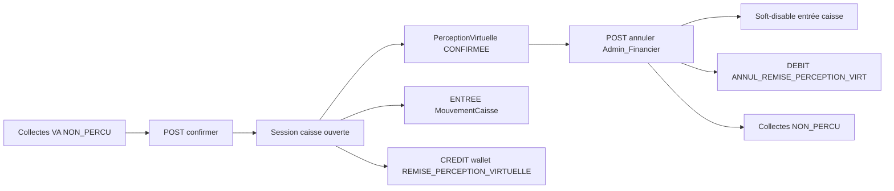

# Intégration Frontend — Livraison API (Vue.js + Flutter)

Guide d’intégration pour les équipes **web Vue.js** et **mobile Flutter** des changements API Prosoc livrés récemment.

Documents complémentaires :

- [`API-DOCUMENTATION-NEW.md`](API-DOCUMENTATION-NEW.md) — référence API globale
- [`PROCESSUS_PERCEPTION_VIRTUELLE.md`](PROCESSUS_PERCEPTION_VIRTUELLE.md) — métier perception / reversement
- [`PROCESSUS_ADHESION_EN_LIGNE_ET_AFFECTATION_AGENT.md`](PROCESSUS_ADHESION_EN_LIGNE_ET_AFFECTATION_AGENT.md) — dossier encodeur AA
- [`FRONTEND_INTEGRATION_RETRAIT_AGENT.md`](FRONTEND_INTEGRATION_RETRAIT_AGENT.md) — pattern paramètres métier / JWT (référence style)

> **Hors scope** : recharge WalletVirtuel via FlexPay Mobile Money (AT) — reportée.

---

## 0) Prérequis communs

| Élément | Détail |
|---|---|
| Authentification | JWT Bearer — `Authorization: Bearer <token>` |
| Format JSON | **camelCase** (ASP.NET Core) |
| Base URL | ex. `https://dev-prosoc.asdc-rdc.org` (**sans** suffixe `/api` dans le client si vous préfixez `/api/...` dans les paths) |
| Claims permission | JWT : claims multiples `permission` |
| Bypass serveur | Rôles `Admin` / `SuperAdmin` : `HasPermission` → toujours true |

### Scripts SQL (ordre recommandé UAT/prod)

```bash
# Perception virtuelle
mysql ... < sql/MigratePerceptionVirtuelleAnnulation.idempotent.sql
mysql ... < sql/MigratePerceptionVirtuelleCaisseWallet.idempotent.sql
# (+ permissions perception si pas déjà déployées)

# Recharge wallet virtuel (plafond + demandes)
mysql ... < sql/MigrateDemandeRechargeWalletVirtuel.idempotent.sql
mysql ... < sql/MigrateDemandeRechargeWalletVirtuelPermissions.idempotent.sql

# Encodeur niveau 2 (Agent AA)
mysql ... < sql/MigrateEncodeAdhesionNiveau2Permission.idempotent.sql
```

Après permissions : **reconnexion JWT** des rôles concernés (Admin, IT, AA, Superviseur, Percepteur, Financier).

### Matrice acteurs × modules

| Module | Web (Vue) | Mobile (Flutter) | Rôles typiques |
|---|---|---|---|
| Prestations gratuites | Catalogue / admin prestations | Catalogue affilié / agent (si exposé) | Public + Admin |
| Perception virtuelle | Portail Percepteur / Financier | App Percepteur (si prévue) | Percepteur, Admin, Financier |
| Recharge wallet (plafond) | Portail Superviseur + Paramètres | App Superviseur | Superviseur, Admin, IT |
| Encodeur niveau 2 | Portail AA | App Agent AA | Agent (AA) |

### Helpers JWT (à réutiliser)

**Vue.js**

```ts
function hasPermission(user: { permissions?: string[]; roles?: string[] }, perm: string): boolean {
  if (user.roles?.includes('Admin') || user.roles?.includes('SuperAdmin')) return true
  return user.permissions?.includes(perm) ?? false
}
```

**Flutter**

```dart
bool hasPermission(List<String> roles, List<String> permissions, String perm) {
  if (roles.contains('Admin') || roles.contains('SuperAdmin')) return true;
  return permissions.contains(perm);
}
```

---

## 1) Prestations gratuites

### API

| Méthode | Route | Auth | Notes |
|---|---|---|---|
| `GET` | `/api/Prestation/gratuites` | AllowAnonymous (comme doc API) | Pagination standard |
| Lectures prestation | `/api/Prestation`, `/api/Prestation/{id}`, … | selon endpoint | Champ **`estGratuit`** dérivé du produit lié |

- Pas de colonne `EstGratuit` en base sur `Prestation`.
- `montant` peut être `0` pour une prestation gratuite.
- Filtre métier : produit (`ProduitMutuel` / `ProduitAssureur`) actif avec `estGratuit: true`.

### Réponse (extrait)

```json
{
  "data": [
    {
      "idPrestation": 12,
      "nom": "Consultation gratuite",
      "montant": 0,
      "estGratuit": true,
      "statut": true
    }
  ],
  "currentPage": 1,
  "pageSize": 20,
  "totalItems": 1
}
```

### Routes UI suggérées

| Plateforme | Route / écran |
|---|---|
| Vue | `/prestations/gratuites` ou filtre « Gratuites » sur `/prestations` |
| Flutter | Liste catalogue avec badge `Gratuit` si `estGratuit == true` |

### Vue (axios)

```ts
export async function fetchPrestationsGratuites(params?: { pageNumber?: number; pageSize?: number }) {
  const { data } = await api.get('/api/Prestation/gratuites', { params })
  return data
}
```

```vue
<span v-if="prestation.estGratuit" class="badge">Gratuit</span>
```

### Flutter (Dio)

```dart
Future<Map<String, dynamic>> fetchPrestationsGratuites({int page = 1, int size = 20}) async {
  final res = await dio.get('/api/Prestation/gratuites', queryParameters: {
    'pageNumber': page,
    'pageSize': size,
  });
  return res.data as Map<String, dynamic>;
}
```

```dart
class PrestationDto {
  final bool estGratuit;
  final double? montant;
  // ...
  factory PrestationDto.fromJson(Map<String, dynamic> j) => PrestationDto(
    estGratuit: j['estGratuit'] as bool? ?? false,
    montant: (j['montant'] as num?)?.toDouble(),
  );
}
```

### Checklist FE

- [ ] Afficher `estGratuit` partout où une prestation est listée / détaillée
- [ ] Ne pas envoyer un champ `estGratuit` en écriture (non stocké sur Prestation)
- [ ] Accepter `montant: 0` sans validation client « montant > 0 » trop stricte

---

## 2) Perception virtuelle — confirmation, annulation, caisse & wallet

Référence métier : [`PROCESSUS_PERCEPTION_VIRTUELLE.md`](PROCESSUS_PERCEPTION_VIRTUELLE.md).

### Rappel flux



### Endpoints utiles

| Méthode | Route | Permission / rôle |
|---|---|---|
| `GET` | `/api/PerceptionVirtuelle/collectes-en-attente` | `READ_PERCEPTION_VIRTUAL` |
| `GET` | `/api/PerceptionVirtuelle/synthese-agents` | idem |
| `GET` | `/api/PerceptionVirtuelle/historique` | idem |
| `GET` | `/api/PerceptionVirtuelle/historique-global` | Admin / Financier |
| `POST` | `/api/PerceptionVirtuelle/confirmer` | `CONFIRM_PERCEPTION_VIRTUAL` |
| `POST` | `/api/PerceptionVirtuelle/{id}/annuler` | `CONFIRM_PERCEPTION_VIRTUAL` **et** rôles `Admin` ou `Financier` |

### Confirmation — corps

```json
{
  "agentId": 42,
  "collecteIds": [101, 102, 103],
  "observation": "Remise terrain matin"
}
```

**Prérequis UI** : ouvrir une session caisse (`OPEN_CAISSIER_SESSION`) pour l’utilisateur qui confirme, sinon `codeErreur: "SESSION_CAISSIER_REQUISE"`.

### Annulation — corps

```json
{
  "motif": "Erreur de lot — collectes déjà encaissées ailleurs"
}
```

### Effets à refléter dans l’UI

| Après | Collecte `statutPerception` | Caisse | Wallet AT |
|---|---|---|---|
| Confirmer | `PERCU` | `ENTREE` source `PERCEPTION_VIRTUELLE` | `CREDIT` `REMISE_PERCEPTION_VIRTUELLE` |
| Annuler | `NON_PERCU` (rééligible) | entrée soft-désactivée | `DEBIT` `ANNUL_REMISE_PERCEPTION_VIRT` |

### Routes UI suggérées

| Plateforme | Route / écran |
|---|---|
| Vue | `/perception-virtuelle/en-attente`, `/perception-virtuelle/historique`, bouton Annuler (Admin/Financier) |
| Flutter | Écran « Remises à percevoir » + détail agent + action Confirmer |

### Vue — confirmer + gérer session manquante

```ts
async function confirmerPerception(payload: { agentId: number; collecteIds: number[]; observation?: string }) {
  try {
    const { data } = await api.post('/api/PerceptionVirtuelle/confirmer', payload)
    return data
  } catch (e: any) {
    const body = e.response?.data
    if (body?.codeErreur === 'SESSION_CAISSIER_REQUISE') {
      // Rediriger vers ouverture de session caisse
      router.push({ name: 'caisse-session-open', query: { returnTo: 'perception-confirmer' } })
    }
    throw e
  }
}

async function annulerPerception(id: number, motif: string) {
  const { data } = await api.post(`/api/PerceptionVirtuelle/${id}/annuler`, { motif })
  return data
}
```

Masquer le bouton Annuler si `!hasPermission('CONFIRM_PERCEPTION_VIRTUAL')` ou si le rôle n’est ni Admin ni Financier.

### Flutter — confirmer

```dart
Future<void> confirmerPerception({
  required int agentId,
  required List<int> collecteIds,
  String? observation,
}) async {
  try {
    await dio.post('/api/PerceptionVirtuelle/confirmer', data: {
      'agentId': agentId,
      'collecteIds': collecteIds,
      if (observation != null) 'observation': observation,
    });
  } on DioException catch (e) {
    final code = e.response?.data is Map ? e.response!.data['codeErreur'] : null;
    if (code == 'SESSION_CAISSIER_REQUISE') {
      // Naviguer vers l’écran d’ouverture de session caisse
      throw SessionCaisseRequiseException();
    }
    rethrow;
  }
}
```

### Checklist FE

- [ ] Bloquer Confirmer côté UX si aucune session caisse ouverte (appel `READ_CAISSIER_SESSION` / session courante)
- [ ] Après confirm : retirer les collectes de la file `NON_PERCU` ; rafraîchir synthèse agents
- [ ] Après annuler : remettre les collectes en file ; afficher statut perception `ANNULEE`
- [ ] Ne pas proposer Annuler aux Percepteurs (réservé Admin/Financier)

---

## 3) Demande de recharge WalletVirtuel + plafond

### 3.1 Paramètre plafond (Admin / IT)

| Méthode | Route | Permission |
|---|---|---|
| `GET` | `/api/parametres-metier/plafond-wallet-virtuel` | `READ_PARAMETRES_METIER` |
| `PUT` | `/api/parametres-metier/plafond-wallet-virtuel` | `UPDATE_PARAMETRES_METIER` |

```json
{ "plafondSolde": 100 }
```

Réponse lecture : `plafondSolde`, `dateModification`, `modifieParUtilisateurId`, `modifieParNom`.

**Vue** : page `/parametres/plafond-wallet-virtuel` (même pattern que retrait-agent / pénalité).

### 3.2 Demandes de recharge (Superviseur)

Montant **toujours calculé serveur** : `plafondSolde − soldeVirtuel`. Le client **n’envoie pas** le montant.

| Méthode | Route | Permission |
|---|---|---|
| `POST` | `/api/DemandeRechargeWalletVirtuel` | `CREATE_DEMANDE_RECHARGE_WALLET_VIRTUEL` |
| `GET` | `/api/DemandeRechargeWalletVirtuel/en-attente` | `READ_DEMANDE_RECHARGE_WALLET_VIRTUEL` |
| `GET` | `/api/DemandeRechargeWalletVirtuel` | idem (paginé, filtre `statutDemande`) |
| `GET` | `/api/DemandeRechargeWalletVirtuel/{id}` | idem |
| `GET` | `/api/DemandeRechargeWalletVirtuel/by-agent/{agentId}` | idem |
| `POST` | `/api/DemandeRechargeWalletVirtuel/{id}/confirmer` | `CONFIRM_DEMANDE_RECHARGE_WALLET_VIRTUEL` |
| `POST` | `/api/DemandeRechargeWalletVirtuel/{id}/rejeter` | idem |

Hiérarchie : `CanRechargeWalletVirtuel` (agent cible plus junior) — erreur `HIERARCHIE_RECHARGE_INTERDITE`.

#### Création

```json
{
  "agentId": 42,
  "motif": "Solde bas — besoin terrain"
}
```

Réponse (extrait) :

```json
{
  "idDemande": 7,
  "agentId": 42,
  "montantCalcule": 70.00,
  "soldeAuMomentDemande": 30.00,
  "plafondAuMomentDemande": 100.00,
  "statutDemande": "EN_ATTENTE"
}
```

#### Confirmation

`POST /api/DemandeRechargeWalletVirtuel/7/confirmer` — body vide.  
Recalcule le montant ; crédit wallet ; mouvement source `RECHARGE_PLAFOND` ; `statutDemande: "CONFIRMEE"`.

#### Rejet

```json
{ "motif": "Dossier incomplet" }
```

### Distinction avec recharge manuelle

| Rail | Endpoint | Qui | Montant |
|---|---|---|---|
| Manuel | `PUT /api/WalletVirtuelAgent/{id}/ajouter-solde` | Admin / hiérarchie + `UPDATE_WALLET_VIRTUEL` | Libre |
| Demande plafond | `DemandeRechargeWalletVirtuel` | Superviseur | `plafond − solde` |

Ne pas fusionner les deux écrans UX.

### Routes UI suggérées

| Plateforme | Route / écran |
|---|---|
| Vue | `/parametres/plafond-wallet-virtuel`, `/supervision/recharges-wallet/en-attente`, `/supervision/recharges-wallet/nouvelle` |
| Flutter | Liste agents avec solde + CTA « Demander recharge » ; file d’attente Superviseur |

### Vue

```ts
export function createDemandeRechargeApi(client: AxiosInstance) {
  return {
    getPlafond: () => client.get('/api/parametres-metier/plafond-wallet-virtuel'),
    putPlafond: (plafondSolde: number) =>
      client.put('/api/parametres-metier/plafond-wallet-virtuel', { plafondSolde }),
    create: (agentId: number, motif?: string) =>
      client.post('/api/DemandeRechargeWalletVirtuel', { agentId, motif }),
    enAttente: () => client.get('/api/DemandeRechargeWalletVirtuel/en-attente'),
    confirmer: (id: number) => client.post(`/api/DemandeRechargeWalletVirtuel/${id}/confirmer`),
    rejeter: (id: number, motif: string) =>
      client.post(`/api/DemandeRechargeWalletVirtuel/${id}/rejeter`, { motif }),
  }
}
```

Afficher `montantCalcule` en **lecture seule** après création (preview). Au confirm, afficher `montantCredite` / `soldeApresCredit`.

### Flutter

```dart
Future<Map<String, dynamic>> creerDemandeRecharge(int agentId, {String? motif}) async {
  final res = await dio.post('/api/DemandeRechargeWalletVirtuel', data: {
    'agentId': agentId,
    if (motif != null) 'motif': motif,
  });
  return res.data as Map<String, dynamic>;
}

Future<List<dynamic>> fetchRechargesEnAttente() async {
  final res = await dio.get('/api/DemandeRechargeWalletVirtuel/en-attente');
  return res.data as List<dynamic>;
}
```

Erreurs à gérer dans l’UI :

| `codeErreur` | UX |
|---|---|
| `SOLDE_AU_PLAFOND` | Message « Solde déjà au plafond » — désactiver CTA |
| `DEMANDE_EN_ATTENTE_EXISTANTE` | Lien vers la demande existante |
| `HIERARCHIE_RECHARGE_INTERDITE` | Toast 403 métier |

### Checklist FE

- [ ] Ne jamais envoyer `montant` à la création
- [ ] Une seule demande `EN_ATTENTE` par agent (désactiver CTA si déjà en file)
- [ ] Après confirm : rafraîchir solde wallet (`GET /api/WalletVirtuelAgent/solde/{agentId}`)
- [ ] Menus conditionnés aux 3 permissions CREATE / READ / CONFIRM

---

## 4) Permission encodeur niveau 2 — Agent (AA)

### Changement breaking (auth)

| Avant | Après |
|---|---|
| `UPDATE_ADHESION` | **`ENCODE_ADHESION_NIVEAU_2`** |

Endpoint inchangé : `PUT /api/Adhesion/{id}/niveau-2-encodeur`

Sans le claim → **403** `Permission requise : ENCODE_ADHESION_NIVEAU_2`.

Script : `sql/MigrateEncodeAdhesionNiveau2Permission.idempotent.sql` + **reconnexion JWT AA**.

### UI

| Plateforme | Action |
|---|---|
| Vue | Bouton « Valider / encoder dossier » visible si `hasPermission(..., 'ENCODE_ADHESION_NIVEAU_2')` |
| Flutter | Idem sur l’écran fiche encodeur AA |

```ts
const canEncodeNiveau2 = computed(() =>
  hasPermission(currentUser.value, 'ENCODE_ADHESION_NIVEAU_2')
)
```

```dart
final canEncodeNiveau2 = hasPermission(roles, permissions, 'ENCODE_ADHESION_NIVEAU_2');
```

> `UPDATE_ADHESION` peut rester dans le JWT AA pour d’autres écrans — **ne plus l’utiliser** pour ce bouton.

### Checklist FE

- [ ] Remplacer le gate UI `UPDATE_ADHESION` → `ENCODE_ADHESION_NIVEAU_2` sur niveau-2-encodeur
- [ ] Tester avec un AA reconnecté après migration SQL
- [ ] Gérer 403 avec message invitant à se reconnecter / contacter l’admin

---

## 5) Annexes

### Codes erreur utiles

| Code | Module | HTTP typique | Action FE |
|---|---|---|---|
| `SESSION_CAISSIER_REQUISE` | Perception confirmer | 400 | Ouvrir session caisse |
| `COLLECTE_DEJA_PERCUE` | Perception confirmer | 409 | Rafraîchir file |
| `DEJA_ANNULEE` | Perception annuler | 409 | Afficher déjà annulée |
| `SOLDE_AU_PLAFOND` | Recharge wallet | 400 | Désactiver demande |
| `DEMANDE_EN_ATTENTE_EXISTANTE` | Recharge wallet | 409 | Ouvrir demande existante |
| `HIERARCHIE_RECHARGE_INTERDITE` | Recharge / ajouter-solde | 403 | Message hiérarchie |
| `Permission requise : …` | Tous | 403 | Cacher CTA / reconnect JWT |

### Checklist non-régression FE

- [ ] Retrait agent (jeton / caisse) inchangé
- [ ] FlexPay collecte / adhésion inchangé
- [ ] `PUT …/ajouter-solde` toujours disponible pour Admin (séparé de la demande plafond)
- [ ] Adhésion AA : seul le gate permission du niveau-2 a changé
- [ ] Menus conditionnés aux **nouveaux** claims après reconnect

### Matrice permissions JWT à tester

| Permission | Rôles typiques |
|---|---|
| `READ_PERCEPTION_VIRTUAL` / `CONFIRM_PERCEPTION_VIRTUAL` | Percepteur, Financier, Admin |
| `READ_PARAMETRES_METIER` / `UPDATE_PARAMETRES_METIER` | Admin, IT |
| `CREATE_DEMANDE_RECHARGE_WALLET_VIRTUEL` | Superviseur, Admin |
| `READ_DEMANDE_RECHARGE_WALLET_VIRTUEL` | Superviseur, Admin |
| `CONFIRM_DEMANDE_RECHARGE_WALLET_VIRTUEL` | Superviseur, Admin |
| `ENCODE_ADHESION_NIVEAU_2` | Agent (AA), Admin |

### Liens rapides API

- Prestations gratuites — [`API-DOCUMENTATION-NEW.md`](API-DOCUMENTATION-NEW.md) (catalogue gratuit)
- Perception — section PerceptionVirtuelle + scripts SQL
- Recharge wallet — section Demande de recharge Wallet Virtuel
- Encodeur — `PUT …/niveau-2-encodeur` + `ENCODE_ADHESION_NIVEAU_2`
