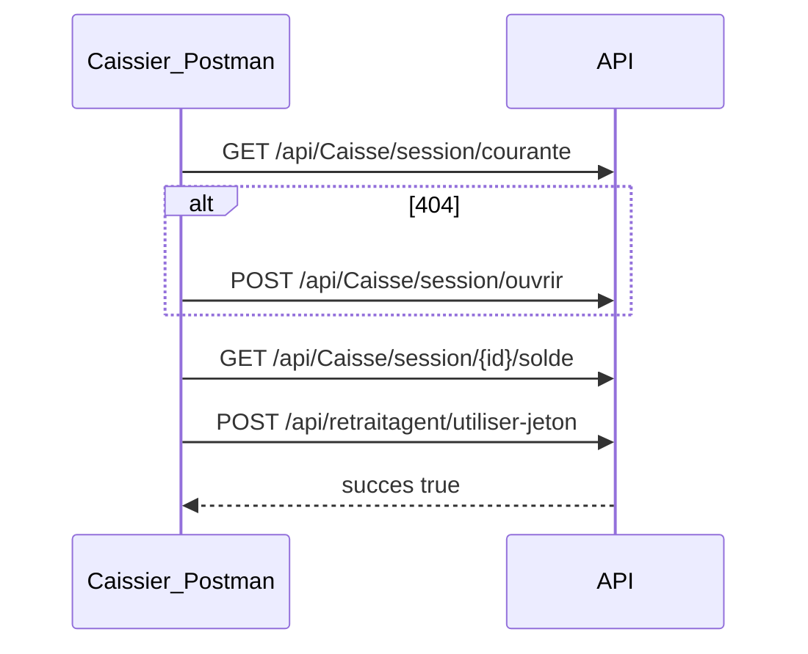

# Guide Postman — Session caisse avant paiement retrait

Ce guide décrit le flux API à enchaîner **avant** `POST /api/retraitagent/utiliser-jeton` lorsque l'API renvoie :

```json
{
  "succes": false,
  "codeErreur": "SESSION_CAISSIER_REQUISE",
  "message": "Aucune session de caisse ouverte. Ouvrez une session avant de payer un retrait."
}
```

Documents connexes :

- [`FRONTEND_INTEGRATION_RETRAIT_AGENT.md`](FRONTEND_INTEGRATION_RETRAIT_AGENT.md) — intégration complète
- [`PROCESSUS_RETRAIT_AGENT.md`](PROCESSUS_RETRAIT_AGENT.md) — workflow métier
- [`API-DOCUMENTATION-NEW.md`](API-DOCUMENTATION-NEW.md) — référence API

---

## Prérequis

| Élément | Détail |
|---------|--------|
| JWT | Compte `Caissier`, `Percepteur`, `Financier` ou `Admin` |
| Demande | Statut `VALIDEE` + jeton valide non expiré |
| Header | `Authorization: Bearer <token>` |
| Base URL | ex. `https://dev-prosoc.asdc-rdc.org` (sans `/api` dans la variable) |

---

## Flux en 4 étapes



### Étape 1 — Session courante

```http
GET {{baseUrl}}/api/Caisse/session/courante
Authorization: Bearer {{token}}
```

| Réponse | Action |
|---------|--------|
| **200** | Noter `idSessionCaisse`, `soldeCourant` → étape 3 |
| **404** | `{ "error": "Aucune session de caisse ouverte" }` → étape 2 |

### Étape 2 — Ouvrir une session

```http
POST {{baseUrl}}/api/Caisse/session/ouvrir
Authorization: Bearer {{token}}
Content-Type: application/json

{
  "soldeOuverture": 500000
}
```

- `soldeOuverture` = espèces physiques en caisse au début de journée.
- Doit être **≥ montant du jeton** (ou complété par des collectes espèce ensuite).
- Une seule session OUVERTE par utilisateur à la fois.

cURL :

```bash
export BASE="https://dev-prosoc.asdc-rdc.org"
export TOKEN="eyJhbGciOiJIUzI1NiIs..."

curl -s "$BASE/api/Caisse/session/courante" -H "Authorization: Bearer $TOKEN"

curl -s -X POST "$BASE/api/Caisse/session/ouvrir" \
  -H "Authorization: Bearer $TOKEN" \
  -H "Content-Type: application/json" \
  -d '{"soldeOuverture": 500000}'
```

### Étape 3 — Vérifier le solde (recommandé)

```http
GET {{baseUrl}}/api/Caisse/session/{{idSessionCaisse}}/solde
Authorization: Bearer {{token}}
```

Si `soldeCourant` < `montantRetrait` du jeton → corriger avant paiement (sinon `SOLDE_CAISSE_INSUFFISANT`).

### Étape 4 — Payer le jeton

```http
POST {{baseUrl}}/api/retraitagent/utiliser-jeton
Authorization: Bearer {{token}}
Content-Type: application/json

{
  "idJeton": 88,
  "codeJeton": "RTA-20260716-ABC123",
  "agentId": 42,
  "observationUtilisation": "Paiement guichet",
  "sessionCaisseId": null
}
```

- `sessionCaisseId: null` → utilise la session **OUVERTE** du JWT connecté.
- Utiliser le **même token** qu'à l'ouverture de session.

Succès :

```json
{
  "succes": true,
  "montantPaye": 150000,
  "soldeCaisseSessionApres": 350000,
  "sessionCaisseId": 12
}
```

---

## Collection Postman prête à importer

Fichier : [`postman/Session_Caisse_Retrait_Agent.postman_collection.json`](postman/Session_Caisse_Retrait_Agent.postman_collection.json)

Import : Postman → **Import** → sélectionner le JSON.

Dossiers de la collection :

| Dossier | Contenu |
|---------|---------|
| **A — Caissier** | Session courante → ouvrir → solde → `utiliser-jeton` |
| **B — Scénario complet** | Période → demande → valider + jeton |
| **C — Fin de journée** | Clôturer → vérifier 404 → liste sessions |

Avant de lancer : renseigner les variables de collection `tokenCaissier`, `tokenAgent`, `tokenValidateur`, `agentId`, `agentValidationId`.

Les scripts Tests peuplent automatiquement `idSessionCaisse`, `idDemande`, `idJeton`, `codeJeton`.

### Ordre manuel (sans collection)

1. `POST /api/retraitagent` — agent crée demande (période ouverte)
2. `POST /api/retraitagent/valider-et-generer-jeton` — validateur → `codeJeton`
3. `GET /api/Caisse/session/courante` — caissier
4. Si 404 → `POST /api/Caisse/session/ouvrir`
5. `GET /api/Caisse/session/{id}/solde` — contrôle solde
6. `POST /api/retraitagent/utiliser-jeton`

---

## Fin de journée — clôture et réouverture

```http
POST {{baseUrl}}/api/Caisse/session/{{idSessionCaisse}}/cloturer
Authorization: Bearer {{token}}
Content-Type: application/json

{
  "soldeReelCloture": 348500,
  "observationCloture": "Écart 1500 CDF"
}
```

Après clôture :

- `GET session/courante` → **404**
- Le lendemain : refaire **étape 2** (`session/ouvrir`) avant tout nouveau paiement retrait

---

## Erreurs fréquentes

| `codeErreur` | Cause | Correction |
|--------------|-------|------------|
| `SESSION_CAISSIER_REQUISE` | Pas de session OUVERTE pour ce JWT | Ouvrir session avec le **même compte** |
| `SOLDE_CAISSE_INSUFFISANT` | Fond de caisse insuffisant | Augmenter `soldeOuverture` ou collectes espèce |
| `JETON_EXPIRE` | Jeton expiré | Nouvelle demande + validation |
| `JETON_DEJA_UTILISE` | 409 | Jeton déjà payé |
| `DEMANDE_INVALIDE` | Pas en `VALIDEE` | Valider la demande d'abord |
| `HORS_PERIODE` | Hors fenêtre calendaire | Attendre période autorisée |

---

## Points d'attention

1. **Même utilisateur** : session liée à `UtilisateurId` du JWT.
2. **Prod/UAT** : session obligatoire (contrairement aux tests automatisés `IntegrationTests`).
3. **Migration** : `sql/MigrateCaisseSession.production.idempotent.sql` si tables absentes.
