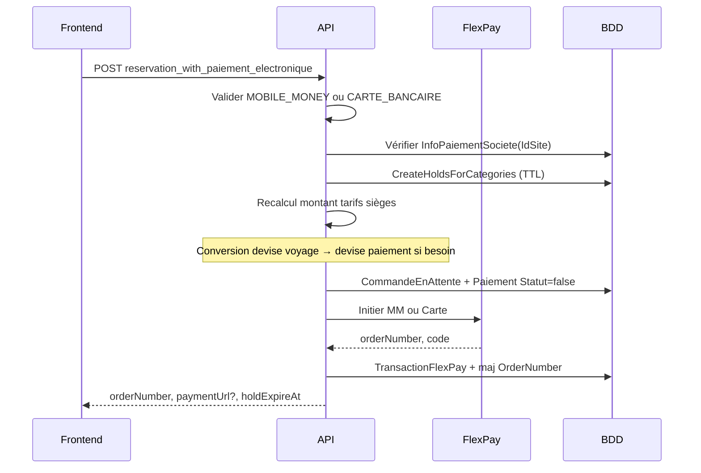

# Guide complet — Intégration FlexPay (paiement électronique) — RusaTravelAPI

Documentation portable pour intégrer **FlexPay** (Mobile Money + carte bancaire) dans **un autre projet**, en s’appuyant sur l’implémentation de référence RusaTravel (transport / réservations).

**Dernière mise à jour** : mai 2026  
**Référence prestataire (générique)** : [`Integration-FlexPay-From-LexMusicaAPI.md`](Integration-FlexPay-From-LexMusicaAPI.md)  
**Multi-devise (conversion CDF/USD)** : [`Integration-MultiDevise-From-RusaTravelAPI.md`](Integration-MultiDevise-From-RusaTravelAPI.md)  
**Scripts SQL** : [`Scripts/FlexPay-only-migrations.sql`](Scripts/FlexPay-only-migrations.sql)  
**Règles opérationnelles** : [`Documentation/Themes/06_facturation_paiement/FLEXPAY_STATUT_PAIEMENT_RULES.md`](Documentation/Themes/06_facturation_paiement/FLEXPAY_STATUT_PAIEMENT_RULES.md)

---

## Résumé exécutif

| Élément | Valeur |
|---------|--------|
| Prestataire | FlexPay (RDC) — Mobile Money, Visa/Mastercard |
| Méthodes électroniques | `MOBILE_MONEY`, `CARTE_BANCAIRE` uniquement |
| Guichet | `CASH` — **sans** FlexPay (endpoint séparé) |
| Confirmation | Callback HTTPS public `POST /api/FlexPay/callback` (`code == "0"`) |
| Secours | `GET /api/FlexPay/verifier/{orderNumber}` (JWT) |
| Règle métier clé | **Réservation + billets uniquement après callback succès** |
| Attente | Holds sièges TTL + `CommandeReservationEnAttente` (pas de ligne `Reservation`) |
| Marchand | **1 config FlexPay par site** (`InfoPaiementSociete`) |
| Paiement | **Intégral uniquement** (pas de partiel FlexPay) |
| Devises FlexPay | `CDF` ou `USD` (choix client, conversion via taux société) |

**Démarrage rapide (autre projet)**

1. Lire les [décisions métier](#2-décisions-métier-validées) et l’[architecture](#3-architecture).
2. Appliquer le [schéma SQL](#6-modèle-de-données-et-sql).
3. Porter `FlexPayService` + `FlexPayCallbackService` + config `appsettings`.
4. Exposer callback **HTTPS public** (`[AllowAnonymous]`).
5. Séparer strictement le flux **CASH** du flux **électronique**.
6. Tester : initiation → callback `code=0` → idempotence (double callback).

---

## Table des matières

1. [Décisions métier validées](#2-décisions-métier-validées)
2. [Architecture](#3-architecture)
3. [API FlexPay externe (prestataire)](#4-api-flexpay-externe-prestataire)
4. [Configuration RusaTravel](#5-configuration-rusatravel)
5. [Modèle de données et SQL](#6-modèle-de-données-et-sql)
6. [Flux détaillés](#7-flux-détaillés)
7. [Endpoints API RusaTravel](#8-endpoints-api-rusatravel)
8. [Isolation CASH / sync / reporting](#9-isolation-cash--sync--reporting)
9. [Multi-devise et FlexPay](#10-multi-devise-et-flexpay)
10. [Services .NET à porter](#11-services-net-à-porter)
11. [Intégration frontend](#12-intégration-frontend)
12. [Porter vers un autre projet](#13-porter-vers-un-autre-projet)
13. [Déploiement et exploitation](#14-déploiement-et-exploitation)
14. [Fichiers source](#15-fichiers-source)
15. [Checklist de validation](#16-checklist-de-validation)
16. [Glossaire](#17-glossaire)

---

## 2. Décisions métier validées

| # | Décision | Impact technique |
|---|----------|------------------|
| 1 | `CASH` ≠ FlexPay | Deux endpoints / deux services ; garde `MethodePaiementHelper` |
| 2 | Réservation **après** callback | Pas de `Reservation` ni billet avant `code == "0"` |
| 3 | Holds sièges pendant l’attente | Table `SiegeHoldEnAttente` + TTL (`FlexPay:SeatHoldMinutes`, défaut 15 min) |
| 4 | Pas de paiement partiel FlexPay | Montant serveur recalculé ; rejet si écart > tolérance |
| 5 | 1 marchand / site | Table `InfoPaiementSociete`, `UNIQUE (IdSite)` |
| 6 | Config marchand par super-admin | CRUD `InfoPaiementSociete` ; token jamais renvoyé en clair |
| 7 | Multi-devise au paiement | Client choisit `CodeDevisePaiement` ; conversion voyage → devise paiement |
| 8 | Idempotence callback | Pas de double réservation si FlexPay renvoie 2× le callback |
| 9 | Audit | `CallbackFlexPay` + `TransactionFlexPay` pour chaque tentative |

**Équivalent générique (autre domaine)** : remplacer *Réservation* par *Commande*, *Siège* par *Stock*, *Billet* par *Document* — le pattern « en attente + callback + finalisation » reste identique.

---

## 3. Architecture

```
┌──────────────┐     JWT      ┌─────────────────────────────────────────────┐
│   Frontend   │─────────────▶│ RusaTravel API                               │
│              │              │  POST .../reservation_with_paiement_electronique │
└──────┬───────┘              │       → FlexPayReservationService            │
       │                      │       → holds + CommandeEnAttente + Paiement   │
       │                      │       → FlexPayService → API FlexPay         │
       │                      └──────────────────┬──────────────────────────┘
       │                                         │
       │   CASH (guichet)                        │ Bearer + merchant/site
       ▼                                         ▼
 POST .../reservation_with_paiement      ┌───────────────┐
 (CashReservationWithPaiementService)    │  API FlexPay  │
       │                                  │  MM / Carte   │
       │ immédiat                         └───────┬───────┘
       ▼                                          │
 Réservation + sièges CONFIRME                     │ POST callback (sans JWT)
                                                    ▼
                                           ┌────────────────────┐
                                           │ POST /api/FlexPay/ │
                                           │      callback     │
                                           │ FlexPayCallback   │
                                           │ Service → Résa.   │
                                           └────────────────────┘
```

### Couches

| Couche | Composant RusaTravel | Rôle |
|--------|----------------------|------|
| HTTP client | `FlexPayService` | Appels Mobile Money, Carte v1.1, Check |
| Initiation métier | `FlexPayReservationService` | Holds, commande en attente, appel FlexPay |
| Callback métier | `FlexPayCallbackService` | Audit, idempotence, réservation, billets |
| Disponibilité sièges | `ISiegeDisponibiliteService` | CONFIRME + holds non expirés |
| Guichet | `CashReservationWithPaiementService` | Wrapper CASH-only sur flux existant |
| Config marchand | `InfoPaiementSociete` + controller | Token / code marchand par site |

---

## 4. API FlexPay externe (prestataire)

> Détail exhaustif (PayOut, tous les champs JSON, troubleshooting) : voir [`Integration-FlexPay-From-LexMusicaAPI.md`](Integration-FlexPay-From-LexMusicaAPI.md).

### 4.1 URLs (défaut RusaTravel)

| Usage | URL |
|-------|-----|
| Mobile Money | `https://backend.flexpay.cd/api/rest/v1/paymentService` |
| Carte v1.1 | `https://cardpayment.flexpay.cd/v1.1/pay` |
| Vérification | `https://apicheck.flexpaie.com/api/rest/v1/check/{orderNumber}` |

### 4.2 Mobile Money — corps envoyé

```json
{
  "merchant": "CODE_MARCHAND",
  "type": "1",
  "reference": "RT-abc123...",
  "phone": "243900000000",
  "amount": "71250",
  "currency": "CDF",
  "callbackUrl": "https://votre-api.example/api/FlexPay/callback",
  "return_url": "https://votre-api.example/api/FlexPay/callback"
}
```

- `amount` : entier pour **CDF** ; décimal pour **USD**.
- Header HTTP : `Authorization: Bearer {token}` (token marchand).

### 4.3 Carte bancaire v1.1 — corps envoyé

```json
{
  "authorization": "Bearer {token}",
  "merchant": "CODE_MARCHAND",
  "reference": "RT-abc123...",
  "amount": 25,
  "currency": "USD",
  "description": "Réservation voyage 42",
  "callback_url": "https://.../api/FlexPay/callback",
  "approve_url": "https://.../api/FlexPay/approve",
  "cancel_url": "https://.../api/FlexPay/cancel",
  "decline_url": "https://.../api/FlexPay/decline"
}
```

Réponse succès : `code == "0"`, `orderNumber`, souvent `paymentUrl` → rediriger le navigateur.

### 4.4 Callback FlexPay (entrant)

```json
{
  "code": "0",
  "reference": "RT-abc123def45678",
  "providerReference": "REF-OPERATEUR",
  "orderNumber": "FP123456789",
  "amount": "71250",
  "amountCustomer": "71250",
  "phone": "243900000000",
  "currency": "CDF",
  "createdAt": "2026-05-21T10:00:00",
  "channel": "orange"
}
```

| `code` | Signification |
|--------|----------------|
| `"0"` | Succès → finaliser la commande métier |
| Autre | Échec → libérer holds, marquer paiement en échec |

**Toujours répondre HTTP 200** au callback si le message est traité (même idempotent), pour éviter les retries infinies côté FlexPay.

### 4.5 Réponse initiation (`FlexPayPaymentResponseDto`)

| Champ | Description |
|-------|-------------|
| `code` | `"0"` = accepté par FlexPay |
| `message` | Message lisible |
| `orderNumber` | Identifiant transaction (à stocker) |
| `paymentUrl` / `redirectUrl` / `url` | Redirection carte (premier non vide) |

---

## 5. Configuration RusaTravel

### 5.1 `appsettings.json`

```json
{
  "FlexPay": {
    "Enabled": true,
    "SeatHoldMinutes": 15,
    "CallbackBaseUrl": "https://votre-domaine-api.example/api/FlexPay/callback",
    "MobileMoneyUrl": "https://backend.flexpay.cd/api/rest/v1/paymentService",
    "CardPaymentUrl": "https://cardpayment.flexpay.cd/v1.1/pay",
    "CheckTransactionUrl": "https://apicheck.flexpaie.com/api/rest/v1/check",
    "ForceProductionCallbackInDev": false
  }
}
```

| Clé | Description |
|-----|-------------|
| `Enabled` | `false` = refus initiation électronique (dev/local) |
| `SeatHoldMinutes` | Durée des holds sièges |
| `CallbackBaseUrl` | URL **HTTPS publique** du callback (obligatoire en prod) |
| `ForceProductionCallbackInDev` | En dev, utiliser `CallbackBaseUrl` même en localhost |

### 5.2 Callback URL en développement

Logique `FlexPayUrlHelper.ResolveCallbackUrl` :

| Contexte | URL utilisée |
|----------|----------------|
| Production | Toujours `CallbackBaseUrl` |
| Dev + host public (ngrok, domaine) | `{Scheme}://{Host}/api/FlexPay/callback` |
| Dev + localhost | `CallbackBaseUrl` (tunnel vers env accessible par FlexPay) |

Les URLs carte `approve` / `cancel` / `decline` sont dérivées de `CallbackBaseUrl` (suffixe `/callback` retiré).

### 5.3 Enregistrement DI (`Program.cs`)

```csharp
builder.Services.Configure<FlexPayOptions>(
    builder.Configuration.GetSection(FlexPayOptions.SectionName));
builder.Services.AddHttpClient("FlexPay");
builder.Services.AddScoped<IFlexPayService, FlexPayService>();
builder.Services.AddScoped<IFlexPayReservationService, FlexPayReservationService>();
builder.Services.AddScoped<IFlexPayCallbackService, FlexPayCallbackService>();
builder.Services.AddScoped<ICashReservationWithPaiementService, CashReservationWithPaiementService>();
builder.Services.AddScoped<ISiegeDisponibiliteService, SiegeDisponibiliteService>();
```

---

## 6. Modèle de données et SQL

### 6.1 Tables métier FlexPay

#### `CommandesReservationEnAttente`

Commande transport **non confirmée** (payload JSON complet).

| Colonne | Type | Description |
|---------|------|-------------|
| `IdCommandeReservationEnAttente` | GUID PK | |
| `IdSociete`, `IdSite`, `IdUtilisateur` | int | |
| `MethodePaiement` | string | `MOBILE_MONEY` / `CARTE_BANCAIRE` |
| `MontantVoyage`, `CodeDeviseVoyage` | | Tarif calculé côté voyage |
| `MontantFlexPay`, `CodeDevisePaiement` | | Montant envoyé à FlexPay |
| `TauxVersDevisePaiement` | decimal | Snapshot conversion |
| `OrderNumberFlexPay`, `ReferenceFlexPay` | string | Réf. FlexPay |
| `PayloadMetierJson` | longtext | Snapshot `InitiateFlexPayReservationDto` |
| `IdPaiementEnAttente` | int FK | Lien `Paiements` |
| `DateExpiration` | datetime | Aligné sur TTL holds |

#### `SiegeHoldsEnAttente`

| Colonne | Description |
|---------|-------------|
| `IdVoyage`, `IdSiege` | Siège bloqué |
| `IdCommandeReservationEnAttente` | Lien commande |
| `ExpireAt` | Fin du hold |

**Contrainte** : `UNIQUE (IdVoyage, IdSiege)` — un siège ne peut être hold qu’une fois par voyage.

#### `InfoPaiementsSociete`

| Colonne | Description |
|---------|-------------|
| `IdSite` | UNIQUE — 1 marchand / site |
| `CodeMarchand` | Code FlexPay |
| `ApiToken` | Bearer (stockage sécurisé ; masqué en API) |
| `ActifMobileMoney`, `ActifCarteBancaire` | Flags |

#### `TransactionsFlexPay`

Suivi technique par transaction (orderNumber, statuts, lien commande / paiement / réservation).

#### `CallbacksFlexPay`

Audit brut de chaque POST callback (payload, IP, succès traitement).

#### Extension `Paiements`

| Colonne | FlexPay |
|---------|---------|
| `Statut` | `false` à l’initiation, `true` au callback OK |
| `StatutPaiementMetier` | `EnAttente` → `Reussi` / `Echec` |
| `IdReservation` | `null` jusqu’au callback |

### 6.2 Migrations EF

| Migration | Contenu |
|-----------|---------|
| `20260524142738_FlexPayRegressionFoundation` | Holds, commandes en attente, `StatutPaiementMetier` |
| `20260524144823_FlexPayCallbackAndInfoPaiement` | `InfoPaiementSociete`, `TransactionsFlexPay`, `CallbacksFlexPay` |

Script SQL autonome : [`Scripts/FlexPay-only-migrations.sql`](Scripts/FlexPay-only-migrations.sql).

---

## 7. Flux détaillés

### 7.1 Initiation (`FlexPayReservationService.InitiateAsync`)



**Étapes serveur**

1. `MethodePaiementHelper.EnsureElectronicOnly`
2. `FlexPay:Enabled == true`
3. Charger `InfoPaiementSociete` pour `IdSite`
4. Créer holds (`ISiegeDisponibiliteService.CreateHoldsForCategoriesAsync`)
5. Recalculer `montantAttendu` (tarifs sièges) — comparer à `dto.Paiement.MontantAPaye` (tolérance 0,05)
6. Conversion multi-devise si `CodeDeviseVoyage` ≠ `CodeDevisePaiement`
7. Persister `CommandeReservationEnAttente` + `Paiement` (`Statut=false`, `StatutPaiementMetier=EnAttente`)
8. Appeler `IFlexPayService` (MM ou Carte)
9. Si `code != "0"` : libérer holds, lever erreur
10. Enregistrer `TransactionFlexPay`, mettre à jour `OrderNumberFlexPay`

### 7.2 Callback succès (`FlexPayCallbackService`)

1. Insérer `CallbackFlexPay` (audit).
2. **Idempotence** : si `Paiement.Statut == true` et `IdReservation` renseigné → `200` sans recréer.
3. Retrouver commande par `orderNumber` ou `reference`.
4. Si `code != "0"` : `MarkFailure` (release holds, échec paiement, supprimer commande).
5. Si `code == "0"` :
   - Valider montant callback vs `MontantFlexPay` (tolérance 0,05).
   - Désérialiser `PayloadMetierJson`.
   - Transaction DB : créer `Reservation` + passagers.
   - `ConfirmHoldsAsAllocationsAsync` → `VoyageSeatAllocation` CONFIRME.
   - Mettre à jour `Paiement` (intégral, `Statut=true`, `StatutPaiementMetier=Reussi`).
   - Supprimer `CommandeReservationEnAttente`.
   - Émettre billets (`BilletEmissionService`) hors transaction si échec billet non bloquant.

### 7.3 Vérification manuelle (`VerifyAndFinalizeAsync`)

Si callback perdu : `GET` API FlexPay check → si statut `0`, rejouer la même logique que callback.

---

## 8. Endpoints API RusaTravel

### 8.1 Initiation (JWT requis)

```http
POST /api/Reservation/reservation_with_paiement_electronique
Authorization: Bearer {token}
Content-Type: application/json
```

**Body**

```json
{
  "reservation": {
    "idVoyage": 10,
    "idClient": 5,
    "nombreDePlace": 1,
    "idUtilisateur": 3,
    "idSociete": 1,
    "idSite": 2,
    "passagers": [
      {
        "nomComplet": "Jean Dupont",
        "idCategorieSiege": 1,
        "telephone": "243900000000"
      }
    ]
  },
  "paiement": {
    "montantAPaye": 71250,
    "methodePaiement": "MOBILE_MONEY",
    "codeDevisePaiement": "CDF",
    "phone": "243900000000",
    "idUtilisateur": 3,
    "idSociete": 1,
    "idSite": 2
  }
}
```

**Réponse 200**

```json
{
  "idCommandeReservationEnAttente": "3fa85f64-5717-4562-b3fc-2c963f66afa6",
  "idPaiementEnAttente": 501,
  "orderNumberFlexPay": "FP123456789",
  "referenceFlexPay": "RT-3fa85f64-5717-45",
  "montantVoyage": 25,
  "codeDeviseVoyage": "USD",
  "montantFlexPay": 71250,
  "codeDevisePaiement": "CDF",
  "tauxApplique": 2850,
  "holdExpireAt": "2026-05-24T16:30:00Z",
  "paymentUrl": null,
  "flexPayAccepted": true,
  "message": "Validez le paiement sur votre téléphone Mobile Money..."
}
```

| Champ | Usage front |
|-------|-------------|
| `paymentUrl` | Redirection si `CARTE_BANCAIRE` |
| `orderNumberFlexPay` | Polling / lien verifier |
| `holdExpireAt` | Compte à rebours UI |

### 8.2 Callback (public)

```http
POST /api/FlexPay/callback
Content-Type: application/json

{ "code": "0", "orderNumber": "...", "reference": "...", "amount": "71250", "currency": "CDF" }
```

**Réponse**

```json
{
  "message": "Réservation créée après confirmation FlexPay.",
  "result": {
    "success": true,
    "alreadyProcessed": false,
    "idReservation": 88,
    "idPaiement": 501
  }
}
```

### 8.3 Vérification (JWT)

```http
GET /api/FlexPay/verifier/FP123456789
Authorization: Bearer {token}
```

### 8.4 Configuration marchand (super-admin)

| Méthode | Route |
|---------|-------|
| GET | `/api/InfoPaiementSociete/site/{idSite}` |
| POST | `/api/InfoPaiementSociete` |
| PUT | `/api/InfoPaiementSociete/{id}` |
| DELETE | `/api/InfoPaiementSociete/{id}` |

**Création**

```json
{
  "idSociete": 1,
  "idSite": 2,
  "codeMarchand": "MON_CODE",
  "apiToken": "Bearer xxxxx",
  "actifMobileMoney": true,
  "actifCarteBancaire": true,
  "statut": true
}
```

Réponse : `apiTokenMasked` uniquement (ex. `********1234`).

### 8.5 Guichet CASH (inchangé fonctionnellement)

```http
POST /api/Reservation/reservation_with_paiement
POST /api/Reservation/with-passengers-and-paiement
```

Uniquement `CASH` (ou alias espèces). Passe par `CashReservationWithPaiementService` → réservation immédiate.

---

## 9. Isolation CASH / sync / reporting

### 9.1 `MethodePaiementHelper`

| Méthode | Constante | FlexPay ? |
|---------|-----------|-----------|
| Guichet | `CASH` | Non |
| Mobile Money | `MOBILE_MONEY` | Oui |
| Carte | `CARTE_BANCAIRE` | Oui |

Garde-fous :

- `EnsureCashOnlyForGuichetEndpoint` — rejette MM/Carte sur endpoint CASH.
- `EnsureElectronicOnly` — rejette CASH sur endpoint électronique.
- `EnsureAllowedForSyncBatch` — rejette MM/Carte en sync offline.

### 9.2 Statuts paiement

| Champ | CASH | FlexPay initiation | FlexPay callback OK |
|-------|------|--------------------|---------------------|
| `Paiement.Statut` | `true` | `false` | `true` |
| `StatutPaiementMetier` | `Reussi` | `EnAttente` | `Reussi` |
| `IdReservation` | renseigné | `null` | renseigné |

**Reporting** (`FinanceReporting`, dashboards caissier) : filtrer `Statut == true` pour ne compter que l’argent réellement encaissé.

### 9.3 Sièges

| Flux | Sièges |
|------|--------|
| CASH | `VoyageSeatAllocation` CONFIRME immédiat |
| FlexPay attente | `SiegeHoldEnAttente` |
| FlexPay succès | Holds → CONFIRME |
| FlexPay échec / expiration | Holds supprimés |

`ISiegeDisponibiliteService` : indisponible = CONFIRME + holds non expirés.

---

## 10. Multi-devise et FlexPay

Scénario : voyage tarifé en **USD**, paiement Mobile Money en **CDF**.

1. Calcul total en `CodeDeviseVoyage`.
2. Client envoie `codeDevisePaiement: "CDF"`.
3. Serveur convertit via `TauxChanges` (direct ou inverse).
4. `MontantFlexPay` arrondi à l’entier si CDF.
5. FlexPay débite en CDF ; snapshot sur commande en attente.

Voir [`Integration-MultiDevise-From-RusaTravelAPI.md`](Integration-MultiDevise-From-RusaTravelAPI.md) pour le module taux complet.

---

## 11. Services .NET à porter

| Interface / classe | Fichier | Priorité |
|--------------------|---------|----------|
| `IFlexPayService` | `Services/IFlexPayService.cs` | P0 |
| `FlexPayService` | `Services/FlexPayService.cs` | P0 |
| `IFlexPayCallbackService` | `Services/Repositories/IFlexPayCallbackService.cs` | P0 |
| `FlexPayCallbackService` | `Services/FlexPayCallbackService.cs` | P0 |
| `IFlexPayReservationService` | `Services/Repositories/IFlexPayReservationService.cs` | P0 |
| `FlexPayReservationService` | `Services/FlexPayReservationService.cs` | P0 — adapter domaine |
| `ISiegeDisponibiliteService` | `Services/SiegeDisponibiliteService.cs` | P0 si stock limité |
| `MethodePaiementHelper` | `Helpers/MethodePaiementHelper.cs` | P0 |
| `FlexPayUrlHelper` | `Helpers/FlexPayUrlHelper.cs` | P1 |
| `FlexPayTokenMaskHelper` | `Helpers/FlexPayTokenMaskHelper.cs` | P1 |
| `CashReservationWithPaiementService` | `Services/CashReservationWithPaiementService.cs` | P0 pour non-régression |

**Adapter dans un autre projet** : remplacer la finalisation callback (`FinalizeSuccessAsync`) par votre use case (création commande, facture, licence, etc.) en conservant le pattern audit + idempotence.

---

## 12. Intégration frontend

### Mobile Money

1. Appeler `POST .../reservation_with_paiement_electronique`.
2. Afficher instructions : « Validez sur votre téléphone ».
3. Proposer lien / bouton « J’ai payé » → `GET /api/FlexPay/verifier/{orderNumber}`.
4. Optionnel : websocket / polling statut commande.

### Carte bancaire

1. Même initiation.
2. Rediriger vers `paymentUrl`.
3. Pages `approve` / `cancel` / `decline` informatives (pas de création auto réservation — le **callback serveur** fait foi).

### UX

- Afficher `montantFlexPay` + `codeDevisePaiement` après preview multi-devise.
- Timer `holdExpireAt`.
- Désactiver le bouton payer si `FlexPay:Enabled` false côté config.

---

## 13. Porter vers un autre projet

### Mapping conceptuel

| RusaTravel | Votre projet (exemple) |
|------------|-------------------------|
| `CommandeReservationEnAttente` | `OrderPending`, `CartPending` |
| `SiegeHoldEnAttente` | `InventoryHold` |
| `Reservation` | `Order`, `Subscription` |
| `Billet` | `Ticket`, `License` |
| `InfoPaiementSociete` | `MerchantConfig` par magasin |

### Checklist

- [ ] Séparer endpoint CASH et électronique.
- [ ] Tables en attente + audit callback + transaction FlexPay.
- [ ] Holds ressource limitée avec TTL.
- [ ] Callback HTTPS public + `[AllowAnonymous]`.
- [ ] Idempotence sur finalisation.
- [ ] Recalcul montant serveur (anti-fraude).
- [ ] Config marchand par point de vente / tenant.
- [ ] Pas de paiement partiel FlexPay.
- [ ] Tests : initiation, callback OK, double callback, échec, expiration hold.
- [ ] Multi-devise si besoin (module taux).

### Anti-patterns

- Créer la commande métier avant le callback.
- Réutiliser l’endpoint guichet pour Mobile Money.
- Exposer le token marchand en GET API.
- Oublier l’arrondi CDF.
- Compter les paiements `Statut=false` dans le CA.

---

## 14. Déploiement et exploitation

### Prérequis production

- [ ] `FlexPay:Enabled = true`
- [ ] `CallbackBaseUrl` HTTPS valide et routé vers l’API
- [ ] `InfoPaiementSociete` pour chaque site actif
- [ ] Migrations SQL appliquées
- [ ] Firewall : autoriser callbacks entrants FlexPay (IPs prestataire si liste fournie)

### Monitoring

- Taux `CallbacksFlexPay.TraiteAvecSucces = false`
- Commandes en attente expirées (holds purgés)
- Écart montant callback vs attendu
- Volume `StatutPaiementMetier = Echec`

### Dev / ngrok

Utiliser `CallbackBaseUrl` pointant vers tunnel public ou `ForceProductionCallbackInDev: true`.

---

## 15. Fichiers source

| Fichier | Rôle |
|---------|------|
| `Services/FlexPayService.cs` | Client HTTP FlexPay |
| `Services/FlexPayReservationService.cs` | Initiation |
| `Services/FlexPayCallbackService.cs` | Callback + verify |
| `Services/CashReservationWithPaiementService.cs` | Garde CASH |
| `Services/SiegeDisponibiliteService.cs` | Holds + disponibilité |
| `Controllers/FlexPayController.cs` | Callback / verifier |
| `Controllers/ReservationController.cs` | Endpoints réservation |
| `Controllers/InfoPaiementSocieteController.cs` | Config marchand |
| `Helpers/MethodePaiementHelper.cs` | Normalisation méthodes |
| `Helpers/FlexPayUrlHelper.cs` | URLs callback |
| `Models/CommandeReservationEnAttente.cs` | |
| `Models/SiegeHoldEnAttente.cs` | |
| `Models/TransactionFlexPay.cs` | |
| `Models/CallbackFlexPay.cs` | |
| `Models/InfoPaiementSociete.cs` | |
| `Models/DTOs/FlexPay/FlexPayDtos.cs` | DTOs callback / config |
| `Models/DTOs/Reservation/InitiateFlexPayReservationDto.cs` | DTO initiation |
| `Configuration/FlexPayOptions.cs` | Options |
| `Tests/FlexPayRegressionTests.cs` | Tests non-régression |
| `Scripts/FlexPay-only-migrations.sql` | DDL |

---

## 16. Checklist de validation

- [ ] `POST` électronique avec `MOBILE_MONEY` + téléphone → push FlexPay
- [ ] `POST` électronique avec `CARTE_BANCAIRE` → `paymentUrl`
- [ ] `POST` guichet avec `CASH` → réservation immédiate (non régression)
- [ ] `POST` guichet avec `MOBILE_MONEY` → **400**
- [ ] Callback `code=0` → réservation + billets + holds libérés
- [ ] Second callback → `alreadyProcessed: true`, une seule réservation
- [ ] Callback échec → pas de réservation, holds libérés
- [ ] `GET verifier` après succès FlexPay check API
- [ ] Sync batch avec MM → rejeté
- [ ] Dashboard CA : paiements en attente exclus
- [ ] Voyage USD + paiement CDF : montants cohérents

---

## 17. Glossaire

| Terme | Définition |
|-------|------------|
| OrderNumber | Identifiant unique transaction FlexPay |
| Reference | Référence marchand (ex. `RT-{guid}`) |
| Hold | Verrou temporaire d’une ressource (siège) |
| Callback | Notification serveur-à-serveur post-paiement |
| Idempotence | Traiter 2× le même callback sans effet de bord |
| Devise paiement | Devise réellement débitée sur FlexPay |

---

*Document généré pour faciliter la réutilisation du module FlexPay RusaTravelAPI dans d’autres applications. Pour les détails API FlexPay bruts et PayOut, compléter avec le guide LexMusica.*
