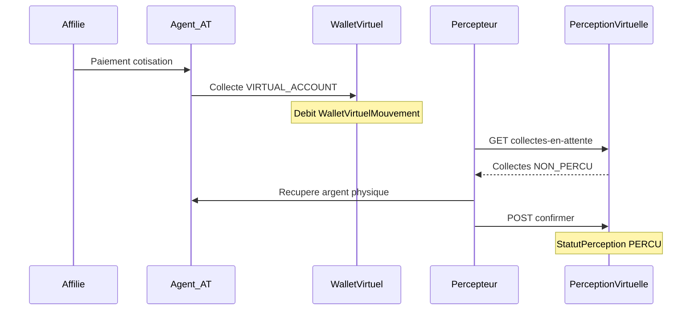

# Processus de perception virtuelle (percepteur)

Ce document décrit le **workflow de perception physique** des collectes effectuées via **compte virtuel** (`VIRTUAL_ACCOUNT`) par les agents (AT), après débit de leur **wallet virtuel**.

Documents connexes :

- [`API-DOCUMENTATION-NEW.md`](API-DOCUMENTATION-NEW.md) — référence API complète (section Dashboard Percepteur)
- [`PROCESSUS_RETRAIT_AGENT.md`](PROCESSUS_RETRAIT_AGENT.md) — retrait commission agent (module distinct, caisse guichet)

---

## Vue d'ensemble

| Étape | Acteur | Action |
|-------|--------|--------|
| 1 | Affilié | Paie sa cotisation à l'agent (AT) |
| 2 | Agent (AT) | Enregistre une collecte `VIRTUAL_ACCOUNT` → **débit wallet virtuel** |
| 3 | Percepteur | Consulte les collectes **non perçues** (`NON_PERCU`) |
| 4 | Percepteur | Se déplace chez l'agent et récupère l'argent physique |
| 5 | Percepteur | **Confirme** la perception via `POST /api/PerceptionVirtuelle/confirmer` |

Les montants sont exprimés en **devise principale** (`MontantDevisePrincipale`, repli `Montant`).

> **Pas de session caisse** : ce flux utilise un journal dédié (`PerceptionVirtuelle`), distinct du guichet caissier.

---

## Flux métier



### Conditions d'éligibilité d'une collecte

Une collecte apparaît en attente de perception si :

- `ModePaiement` = `VIRTUAL_ACCOUNT`
- `StatutPaiement` = valide (`VALIDE` ou legacy accepté)
- `StatutPerception` = `NON_PERCU` (ou null)
- Un mouvement `WalletVirtuelMouvement` de type `DEBIT`, source `CollecteCompteVirtuel`, existe pour cette collecte

---

## Endpoint principal — confirmer la perception

**`POST /api/PerceptionVirtuelle/confirmer`**

C'est l'endpoint qui enregistre que le percepteur a bien perçu l'argent physique auprès de l'agent.

| Élément | Détail |
|---------|--------|
| Auth | JWT Bearer |
| Rôles | `Admin`, `Percepteur`, `Financier` |
| Contrôleur | `PerceptionVirtuelleController` |
| Service | `PerceptionVirtuelleService.ConfirmerPerceptionAsync` |

### Requête

```json
{
  "agentId": 12,
  "collecteIds": [101, 102, 103],
  "observation": "Remise terrain — matinée"
}
```

| Champ | Obligatoire | Description |
|-------|-------------|-------------|
| `agentId` | Oui | Agent (AT) auprès duquel l'argent a été perçu |
| `collecteIds` | Oui (min. 1) | IDs des collectes à marquer comme perçues |
| `observation` | Non | Commentaire libre (max 500 car.) |

### Réponse succès

```json
{
  "succes": true,
  "message": "Perception confirmée avec succès",
  "perceptionVirtuelleId": 45,
  "montantTotal": 150.00,
  "nombreCollectes": 3,
  "soldeRestantAgent": 25.00
}
```

| Champ | Description |
|-------|-------------|
| `perceptionVirtuelleId` | ID du journal de perception créé |
| `montantTotal` | Somme des collectes confirmées (devise principale) |
| `nombreCollectes` | Nombre de collectes traitées |
| `soldeRestantAgent` | Montant restant à percevoir sur cet agent |

### Effets en base

- Création d'un enregistrement `PerceptionVirtuelle` + lignes `PerceptionVirtuelleLigne`
- Mise à jour des collectes : `StatutPerception = PERCU`, `DatePerception`, `PercepteurUtilisateurId`, `PerceptionVirtuelleId`
- Liaison optionnelle au `WalletVirtuelMouvementId` sur chaque ligne

---

## Contrôle finance (Admin / Financier)

### `GET historique-global`

Filtres query : `percepteurUtilisateurId`, `agentId`, `dateDebut`, `dateFin`, `page`, `pageSize`.

Permet de consulter **toutes** les perceptions terrain, pas seulement celles du JWT connecté.

### `GET reconciliation`

Filtres : `agentId?`, `dateDebut?`, `dateFin?` (sur `DateCollecte`).

Réponse : `montantDebitWallet`, `montantNonPerçu`, `montantPerçuTerrain`, compteurs et `anomalies` (`collectesPercuSansJournal`, `debitsSansCollecte`, `collectesVaSansDebit`).

Invariant attendu : `montantDebitWallet ≈ montantNonPerçu + montantPerçuTerrain`.

### `GET export?format=excel`

Mêmes filtres que `rapport-perception` (`origine`, `statut`, dates, `agentId`, `affilieId`). Fichier `.xlsx` avec onglets `Synthese` et `Lignes` (inclut `walletVirtuelMouvementId`).

Migration permissions Financier :

```bash
mysql ... < sql/MigrateFinancierPerceptionVirtuellePermissions.idempotent.sql
```

---

## Endpoints de consultation

Base : `/api/PerceptionVirtuelle/*`

| Méthode | Route | Usage |
|---------|-------|-------|
| GET | `/api/PerceptionVirtuelle/collectes-en-attente` | Liste paginée des collectes VA non perçues |
| GET | `/api/PerceptionVirtuelle/synthese-agents` | Montant / nombre en attente **par agent** |
| GET | `/api/PerceptionVirtuelle/historique` | Journal des perceptions du percepteur connecté |
| GET | `/api/PerceptionVirtuelle/historique-global` | Journal global (Admin / Financier) — filtres `percepteurUtilisateurId`, `agentId`, dates |
| GET | `/api/PerceptionVirtuelle/reconciliation` | Synthèse réconciliation VA + anomalies (Admin / Financier) |
| GET | `/api/PerceptionVirtuelle/export` | Export Excel rapport perception (Admin / Financier) |
| GET | `/api/PerceptionVirtuelle/{id}` | Détail perception + lignes |

### `GET collectes-en-attente` — filtres query

| Paramètre | Type | Description |
|-----------|------|-------------|
| `agentId` | `number?` | Filtrer par agent |
| `dateDebut` | `string?` | Date début (ISO) |
| `dateFin` | `string?` | Date fin (ISO) |
| `page` | `number` | Page (pagination) |
| `pageSize` | `number` | Taille de page |

### Exemple réponse `collectes-en-attente` (extrait)

```json
{
  "data": [
    {
      "idCollecte": 101,
      "agentId": 12,
      "agentIdEffectif": 12,
      "agentNom": "Jean Mukendi",
      "agentMatricule": "AT-0012",
      "affilieId": 500,
      "affilieNom": "Marie Kabila",
      "montant": 50.00,
      "montantDevisePrincipale": 50.00,
      "deviseCode": "USD",
      "dateCollecte": "2026-07-10T09:30:00",
      "typeCollecte": "COTISATION",
      "statutPerception": "NON_PERCU"
    }
  ],
  "currentPage": 1,
  "pageSize": 20,
  "totalItems": 1
}
```

### Exemple réponse `synthese-agents`

```json
[
  {
    "agentId": 12,
    "agentNom": "Jean Mukendi",
    "agentMatricule": "AT-0012",
    "nombreCollectesEnAttente": 5,
    "montantEnAttente": 250.00,
    "deviseCode": "USD"
  }
]
```

---

## Codes d'erreur (`POST confirmer`)

| `codeErreur` | HTTP | Signification |
|--------------|------|---------------|
| `COLLECTE_DEJA_PERCUE` | **409** | Une collecte a déjà été perçue |
| `AGENT_INCOHERENT` | 400 | Une collecte n'appartient pas à l'`agentId` fourni |
| `DEBIT_VIRTUEL_MANQUANT` | 400 | Pas de débit wallet virtuel lié à la collecte |
| `MODE_PAIEMENT_INVALIDE` | 400 | Collecte pas en `VIRTUAL_ACCOUNT` |
| `PAIEMENT_NON_VALIDE` | 400 | Collecte pas au statut `VALIDE` |
| `COLLECTE_INTROUVABLE` | 400 | ID collecte inexistant |
| `COLLECTE_IDS_REQUIS` | 400 | Liste `collecteIds` vide |
| `COLLECTE_IDS_DUPLIQUES` | 400 | Doublons dans `collecteIds` |

Corps erreur typique :

```json
{
  "succes": false,
  "message": "La collecte 101 a déjà été perçue.",
  "codeErreur": "COLLECTE_DEJA_PERCUE"
}
```

---

## Dashboard Percepteur (consultation / KPI)

Rôle requis : `Percepteur` (certaines routes aussi `Admin`).

| Endpoint | Description |
|----------|-------------|
| `GET /api/DashboardPercepteur/kpis` | KPIs incluant `montantVirtuelEnAttente`, `nombreCollectesVirtuellesEnAttente` |
| `GET /api/DashboardPercepteur/rapport-perception` | Rapport Agent (VA) vs Affilié (guichet) |
| `GET /api/DashboardPercepteur/transactions` | Dernières transactions |
| `GET /api/DashboardPercepteur/top-agents` | Top agents par montant perçu |

> Le dashboard sert au **suivi** ; l'action de perception reste `POST /api/PerceptionVirtuelle/confirmer`.

---

## Parcours UI suggéré (percepteur)

1. **Accueil** : `GET synthese-agents` — voir les agents avec montant en attente
2. **Détail agent** : `GET collectes-en-attente?agentId=12` — liste des collectes à percevoir
3. **Terrain** : percepteur récupère l'argent physique chez l'agent
4. **Confirmation** : `POST confirmer` avec `agentId` + `collecteIds` sélectionnés
5. **Historique** : `GET historique` ou `GET {id}` pour le reçu / audit

---

## Différence avec autres modules

| Module | Acteur | Objet | Session caisse |
|--------|--------|-------|----------------|
| **PerceptionVirtuelle** | Percepteur | Collectes VA débitées sur wallet virtuel agent | Non |
| RetraitAgent (`utiliser-jeton`) | Caissier, Percepteur | Retrait commission agent (jeton) | Oui |
| Caisse (`session/ouvrir`) | Caissier | Opérations guichet classiques | Oui |

---

## Migration production

```bash
mysql -h <host> -u <user> -p <database> < sql/MigratePerceptionVirtuelle.production.idempotent.sql
mysql -h <host> -u <user> -p <database> < sql/MigratePerceptionVirtuellePermissions.idempotent.sql
```

---

## Fichiers sources backend

| Fichier | Rôle |
|---------|------|
| [`Controllers/PerceptionVirtuelleController.cs`](Controllers/PerceptionVirtuelleController.cs) | Endpoints REST |
| [`Services/PerceptionVirtuelleService.cs`](Services/PerceptionVirtuelleService.cs) | Logique métier |
| [`Models/DTOs/Core/PerceptionVirtuelleDtos.cs`](Models/DTOs/Core/PerceptionVirtuelleDtos.cs) | Contrats API |
| [`Models/Core/CollecteStatutPerception.cs`](Models/Core/CollecteStatutPerception.cs) | Statuts `NON_PERCU` / `PERCU` |
| [`Controllers/DashboardPercepteurController.cs`](Controllers/DashboardPercepteurController.cs) | KPIs percepteur |

---

## Tests manuels rapides (cURL)

```bash
TOKEN="eyJhbGciOiJIUzI1NiIs..."
BASE="https://dev-prosoc.asdc-rdc.org"

# Synthèse par agent
curl -s "$BASE/api/PerceptionVirtuelle/synthese-agents" \
  -H "Authorization: Bearer $TOKEN" | jq .

# Collectes en attente pour un agent
curl -s "$BASE/api/PerceptionVirtuelle/collectes-en-attente?agentId=12&page=1&pageSize=20" \
  -H "Authorization: Bearer $TOKEN" | jq .

# Confirmer perception
curl -s -X POST "$BASE/api/PerceptionVirtuelle/confirmer" \
  -H "Authorization: Bearer $TOKEN" \
  -H "Content-Type: application/json" \
  -d '{"agentId":12,"collecteIds":[101,102],"observation":"Remise terrain"}' | jq .

# Historique
curl -s "$BASE/api/PerceptionVirtuelle/historique?page=1&pageSize=20" \
  -H "Authorization: Bearer $TOKEN" | jq .
```
