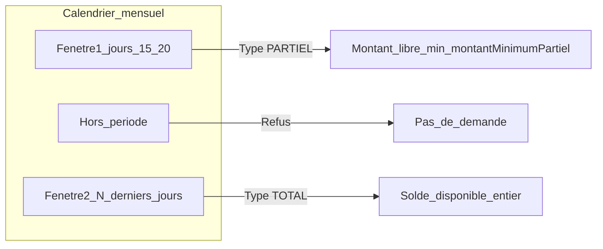
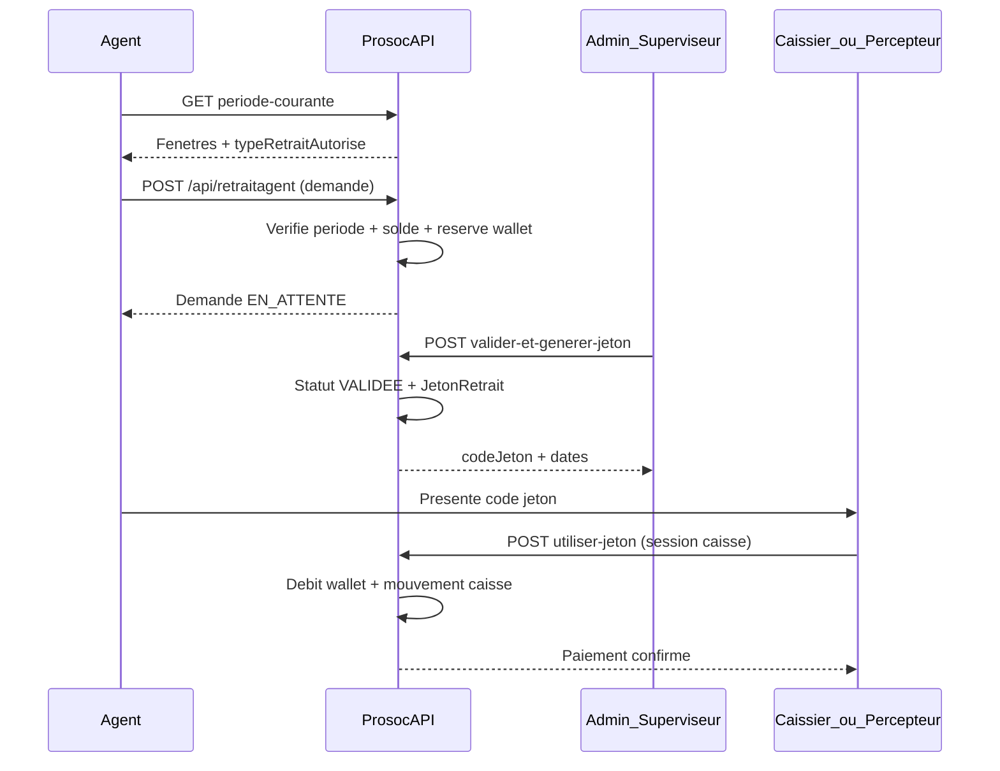

# Processus de retrait agent

Ce document décrit le **workflow de retrait des commissions agent** (demande → validation → jeton → paiement caisse) et la **gestion des paramètres métier** associés (fenêtres de retrait, montants minimums).

Documents connexes :

- [`FRONTEND_INTEGRATION_RETRAIT_AGENT.md`](FRONTEND_INTEGRATION_RETRAIT_AGENT.md) — guide d'intégration frontend Vue.js (Admin, Agent, Validateur, Caissier)
- [`API-DOCUMENTATION-NEW.md`](API-DOCUMENTATION-NEW.md) — référence API complète
- [`PROCESSUS_ADHESION_EN_LIGNE_ET_AFFECTATION_AGENT.md`](PROCESSUS_ADHESION_EN_LIGNE_ET_AFFECTATION_AGENT.md) — parcours adhésion (contexte agent / wallet)

---

## Vue d'ensemble

| Étape | Acteur | Action |
|-------|--------|--------|
| 1 | Agent | Consulte la période autorisée et son solde |
| 2 | Agent | Crée une **demande de retrait** (PARTIEL ou TOTAL selon la fenêtre) |
| 3 | Admin / Superviseur | **Valide** la demande et génère un **jeton** |
| 4 | Caissier / Percepteur | **Utilise le jeton** → débit wallet agent + sortie caisse |
| 5 | Admin / IT | Ajuste les **paramètres métier** (fenêtres, montant minimum) via l'API dédiée |

Les montants sont exprimés en **devise principale** du système (USD en configuration actuelle).

---

## Paramètres métier (Admin / IT)

Les règles de calendrier et de montant minimum ne sont plus figées dans `appsettings.json` : elles sont stockées en base (`ParametresMetier`, code `RETRAIT_AGENT`) et exposées par l'API.

### Permissions requises

| Permission | Rôles typiques |
|------------|----------------|
| `READ_PARAMETRES_METIER` | Admin, IT |
| `UPDATE_PARAMETRES_METIER` | Admin, IT |

### Endpoints configuration

| Méthode | Route | Description |
|---------|-------|-------------|
| GET | `/api/parametres-metier/retrait-agent` | Lit la config + audit (`dateModification`, `modifieParNom`) |
| PUT | `/api/parametres-metier/retrait-agent` | Met à jour la config (validation métier côté API) |

**Corps PUT (exemple) :**

```json
{
  "fenetre1Debut": 15,
  "fenetre1Fin": 20,
  "fenetre2DerniersJours": 7,
  "montantMinimumPartiel": 5
}
```

**Règles de validation :**

- `fenetre1Debut` : 1–28
- `fenetre1Fin` ≥ `fenetre1Debut`, ≤ 31
- `fenetre2DerniersJours` : 1–15 (fenêtre 2 = N derniers jours du mois)
- `montantMinimumPartiel` > 0
- Les deux fenêtres ne doivent pas se chevaucher (contrôle sur mois courts type février)

Au **premier démarrage** sans ligne en base, l'API seed depuis les valeurs par défaut de `RetraitAgentOptions` (ou le script SQL `sql/DeployParametresMetierUat.idempotent.sql`). Ensuite la base fait foi. Les changements Admin/IT sont pris en compte **sans redémarrage** (cache invalidé au PUT).

### Modules connexes (même table `ParametresMetier`)

| Code | Endpoints | Usage |
|------|-----------|-------|
| `AGENT_MAASH` | GET/PUT `/api/parametres-metier/agent-maash` | Retenue MAASH automatique |
| `ARRIERES` | GET/PUT `/api/parametres-metier/arrieres` | Génération arriérés affilié |
| `PENALITE` | GET/PUT `/api/parametres-metier/penalite` | Pénalités retard cotisation |

---

## Fenêtres de retrait

Deux fenêtres mensuelles déterminent **quand** et **quel type** de retrait est autorisé :



| Fenêtre | Période (exemple config par défaut) | Type autorisé | Montant |
|---------|-------------------------------------|---------------|---------|
| **Fenetre1** | 15 → 20 | `PARTIEL` | Montant saisi ≥ `montantMinimumPartiel` |
| **Fenetre2** | 7 derniers jours du mois | `TOTAL` | Solde disponible entier (pas de montant partiel) |
| Hors fenêtre | Reste du mois | — | Demande refusée |

### Endpoints agent (consultation calendrier)

| Méthode | Route | Auth | Description |
|---------|-------|------|-------------|
| GET | `/api/retraitagent/periode-courante` | JWT agent | Fenêtres du mois en cours + type autorisé aujourd'hui |
| POST | `/api/retraitagent/verifier-periode` | JWT agent | Vérifie une date (`body`: `"2026-03-16"`) |

Ces endpoints lisent la config **base de données** via `IParametresMetierProvider`.

---

## Flux demande → jeton → caisse



### 1. Création de demande

**POST** `/api/retraitagent`

- Vérifie la **période courante** (sauf environnement tests).
- Résout le type PARTIEL/TOTAL selon la fenêtre (`RetraitAgentDemandeResolver`).
- **Réserve** le montant sur `SoldeDisponible` du wallet agent.
- Statut initial : `EN_ATTENTE`.

### 2. Validation et jeton

**POST** `/api/retraitagent/valider-et-generer-jeton`

- Passe la demande à `VALIDEE`.
- Crée un `JetonRetrait` (code unique, date expiration).
- Permission typique : workflow superviseur / admin caisse.

### 3. Paiement caisse

**POST** `/api/retraitagent/utiliser-jeton`

- Vérifie jeton valide, non expiré, demande `VALIDEE`.
- Exige une **session caisse ouverte** (sauf mode test).
- Débite le wallet agent, enregistre un **mouvement caisse** sortie.
- Rôles autorisés : `Admin`, `Caissier`, `Financier`, `Percepteur`.
- Permissions JWT associées (menu UI) : `CONFIRM_RETRAIT_AGENT`, `OPEN_CAISSIER_SESSION`, `READ_CAISSIER_SESSION`.
- Marque le jeton comme utilisé.

#### Ouverture de session avant paiement (obligatoire en prod)

Si l'API renvoie `SESSION_CAISSIER_REQUISE`, enchaîner :

1. `GET /api/Caisse/session/courante` — si **404**, passer à 2
2. `POST /api/Caisse/session/ouvrir` — body `{ "soldeOuverture": <montant physique en caisse> }`
3. `GET /api/Caisse/session/{id}/solde` — vérifier `soldeCourant` ≥ montant jeton
4. `POST /api/retraitagent/utiliser-jeton` — **même JWT** que l'ouverture

Guide détaillé Postman/cURL : [`GUIDE_SESSION_CAISSE_RETRAIT_POSTMAN.md`](GUIDE_SESSION_CAISSE_RETRAIT_POSTMAN.md)

Fin de journée : `POST /api/Caisse/session/{id}/cloturer` puis réouverture le lendemain.

### 4. Consultation et suivi

| Route | Usage |
|-------|-------|
| GET `/api/retraitagent` | Liste paginée des demandes |
| GET `/api/retraitagent/by-agent/{agentId}` | Demandes d'un agent |
| GET `/api/retraitagent/en-attente` | File d'attente validation |
| GET `/api/retraitagent/stats/{date}` | Statistiques journalières |

---

## Déploiement / migration

1. Appliquer la migration EF `AddParametresMetier` (table `ParametresMetier`).
2. Exécuter sur UAT/prod :
   - `sql/MigrateParametresMetierPermissions.idempotent.sql`
   - `sql/SeedParametresMetierRetraitAgent.idempotent.sql` (seed initial si lignes absentes)
3. Vérifier `GET /api/parametres-metier/retrait-agent` (compte Admin ou IT).
4. Vérifier `GET /api/retraitagent/periode-courante` (compte agent) reflète la même config.

---

## Scripts SQL

| Fichier | Rôle |
|---------|------|
| `sql/MigrateParametresMetierPermissions.idempotent.sql` | Permissions READ/UPDATE pour Admin et IT |
| `sql/MigratePercepteurRetraitAgentPermissions.idempotent.sql` | Permissions retrait jeton + session caisse pour Percepteur |
| `sql/SeedParametresMetierRetraitAgent.idempotent.sql` | Seed RETRAIT_AGENT + modules connexes |

---

## Notes frontend Admin

- Écran **Paramètres > Retrait agent** : formulaire lié à GET/PUT `/api/parametres-metier/retrait-agent`.
- Afficher `dateModification` / `modifieParNom` pour traçabilité.
- Après PUT réussi, les apps agent voient la nouvelle config via `periode-courante` sans action supplémentaire.
- Gérer les erreurs 400 (validation chevauchement fenêtres, montant invalide) et 403 (permission manquante).
