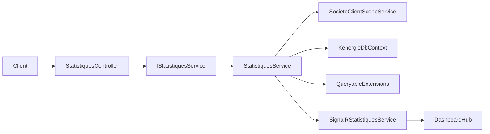

# Documentation API - Module Statistiques

## Vue d'ensemble

Le module `Statistiques` expose 5 endpoints de lecture pour construire des dashboards financiers, operationnels et de performance.

- Base route: `GET /api/Statistiques/*`
- Scope obligatoire: `idSociete` dans la route
- Filtres communs: `idCategorieClient`, `idCabine`, `idAxe`, `idTypeDeCourant`, `idUsage`
- Filtres de periode (`debut`, `fin`) uniquement sur `financieres` et `consolidees`

Architecture d'execution:



## Authentification et securite

Etat actuel du code:
- `Program.cs` configure JWT (`AddAuthentication("Bearer")`) et autorisation (`AddAuthorization()`).
- `StatistiquesController` n'a pas d'attribut `[Authorize]` au niveau classe ou action.

Recommendation pour reproduction dans un autre projet .NET:
- Ajouter `[Authorize]` sur le controller.
- Ajouter ensuite une politique/permission par endpoint selon vos roles metier.

Header standard a utiliser:

```http
Authorization: Bearer {jwt_token}
```

## Parametres communs

### Parametre de route

| Nom | Type | Requis | Description |
|---|---|---|---|
| `idSociete` | int | Oui | Identifiant de la societe cible |

### Filtres query communs

| Nom | Type | Requis | Regle de filtrage |
|---|---|---|---|
| `idCategorieClient` | int? | Non | Client avec au moins un `ClientUsage` actif dont `Usage.IdCategorieClient` correspond |
| `idCabine` | int? | Non | Filtre indirect via `Client.Axe.IdCabine` |
| `idAxe` | int? | Non | Filtre direct `Client.IdAxe` |
| `idTypeDeCourant` | int? | Non | Client avec `ClientUsage` actif portant `IdTypeDeCourant` |
| `idUsage` | int? | Non | Client avec `ClientUsage` actif portant `IdUsage` |

Notes:
- Les filtres sont combines en logique `AND`.
- Sans filtre, le service garde tout le scope client de la societe.

## Scopes clients utilises par le service

Le service se base sur deux scopes distincts:

1. Scope actif (`GetActiveClientIdsAsync`)
   - clients operationnels actifs (`IsActif = true`, `Statut = true`, non soft-deleted)
   - sert aux compteurs operationnels (ex: `totalClients`, repartitions)

2. Scope financier (`GetFinancialClientIdsAsync`)
   - clients lies a la societe via `Categorie -> Usage -> ClientUsage`, sans exiger `IsActif/Statut`
   - sert aux montants (`paiements`, `arrieres`, `collecte`)

## Endpoints

---

### 1) Statistiques generales

`GET /api/Statistiques/generales/{idSociete}`

#### Query params

- Filtres communs uniquement

#### Regles metier

- `totalClients`: nombre de clients du scope actif
- `totalPaiements`: somme des paiements valides du mois calendaire en cours
- `totalPaiementsCount`: nombre de paiements valides du mois calendaire en cours
- `totalArrieres`: somme des `ClientFactures.MontantDu > 0` actives (scope financier)
- `totalFactures`: nombre de factures du mois precedent (M-1)
- `tauxRecouvrement`: `(collecte mois M / montant facture mois M-1) * 100`, arrondi 2 decimales

#### Exemple

```http
GET /api/Statistiques/generales/1?idAxe=4&idUsage=2
```

```json
{
  "totalClients": 1072,
  "totalFactures": 47,
  "totalArrieres": 2611000.00,
  "totalPaiements": 26000.00,
  "tauxRecouvrement": 99.00,
  "totalPaiementsCount": 2,
  "dateGeneration": "2026-02-15T22:45:27.96525+02:00"
}
```

---

### 2) Statistiques financieres

`GET /api/Statistiques/financieres/{idSociete}`

#### Query params

- `debut` (DateTime, optionnel)
- `fin` (DateTime, optionnel)
- Filtres communs

#### Regles metier

- `chiffreAffaires`: toujours la collecte du mois calendaire en cours
- `montantPaye`:
  - sans `debut/fin`: identique a `chiffreAffaires`
  - avec `debut` et/ou `fin`: somme des paiements valides sur la fenetre fournie
- `repartitionPaiements`: calculee sur la meme fenetre que `montantPaye`
- `evolutionMensuelle`:
  - sans `debut/fin`: de `01/01` de l'annee courante a aujourd'hui
  - avec `debut/fin`: fenetre personnalisee
- `montantArrieres` et `montantDu`: cumul des soldes dus des factures actives

#### Exemple

```http
GET /api/Statistiques/financieres/1?debut=2026-01-01&fin=2026-02-28&idCategorieClient=5
```

```json
{
  "chiffreAffaires": 2637000.00,
  "montantArrieres": 2611000.00,
  "montantPaye": 26000.00,
  "montantDu": 2611000.00,
  "evolutionMensuelle": [
    {
      "mois": "janvier 2026",
      "montantFactures": 476000.00,
      "montantPaiements": 0.00,
      "montantArrieres": 476000.00,
      "nombreFactures": 37,
      "nombrePaiements": 0
    }
  ],
  "repartitionPaiements": [
    {
      "methodePaiement": "Espace",
      "montantTotal": 26000.00,
      "nombrePaiements": 2,
      "pourcentage": 100
    }
  ],
  "dateGeneration": "2026-02-15T22:45:39.352638+02:00"
}
```

---

### 3) Statistiques operationnelles

`GET /api/Statistiques/operationnelles/{idSociete}`

#### Query params

- Filtres communs uniquement

#### Regles metier

- `repartitionClientsParCategorie`: distribution des clients actifs par categorie
- `repartitionClientsParAxe`: distribution des clients actifs par axe/cabine
- `statistiquesFacturesMois`: agregats mensuels des factures (scope financier)
- `clientActivite`: split actifs/inactifs sur scope financier

#### Exemple

```http
GET /api/Statistiques/operationnelles/1?idCabine=2
```

```json
{
  "repartitionClientsParCategorie": [
    {
      "idCategorie": 5,
      "nomCategorie": "DOMESTIQUE",
      "nombreClients": 934,
      "pourcentage": 86.96,
      "montantTotal": 673000.00
    }
  ],
  "repartitionClientsParAxe": [
    {
      "idAxe": 26,
      "nomAxe": "E4",
      "nomCabine": "CABINE E",
      "nombreClients": 277,
      "pourcentage": 25.84
    }
  ],
  "statistiquesFacturesMois": [
    {
      "mois": "janvier 2026",
      "montantTotal": 494000.00,
      "nombreFactures": 37,
      "montantMoyen": 13351.35
    }
  ],
  "clientActivite": {
    "nombreClientsActifs": 1072,
    "nombreClientsInactifs": 0,
    "totalClients": 1072,
    "pourcentageActifs": 100,
    "pourcentageInactifs": 0
  },
  "dateGeneration": "2026-02-15T22:45:51.830389+02:00"
}
```

---

### 4) Statistiques de performance

`GET /api/Statistiques/performance/{idSociete}`

#### Query params

- Filtres communs uniquement

#### Regles metier

- `tauxRecouvrementGlobal`: paiements valides du mois M / factures du mois M-1
- `tauxRecouvrementParCategorie`: meme logique, detaillee par categorie
- `topAgents`:
  - prend les agents avec role `Caissier`
  - calcule la collecte du mois en cours uniquement
  - exclut les agents avec `montantCollecte <= 0`
  - trie par collecte decroissante et limite a 10
  - `tauxConversion` est calcule selon la logique actuelle du service (`100 / nombrePaiements`, arrondi 2 decimales)
- `performanceMensuelle`: tendance des 6 derniers mois

#### Exemple

```http
GET /api/Statistiques/performance/1?idTypeDeCourant=3
```

```json
{
  "tauxRecouvrementGlobal": 1.00,
  "tauxRecouvrementParCategorie": [
    {
      "idCategorie": 5,
      "nomCategorie": "DOMESTIQUE",
      "tauxRecouvrement": 4.02,
      "montantDu": 647000.00,
      "montantPaye": 26000.00
    }
  ],
  "topAgents": [
    {
      "idAgent": 1,
      "nomAgent": "Administrateur Super Admin",
      "montantCollecte": 26000.00,
      "nombrePaiements": 2,
      "tauxConversion": 50
    }
  ],
  "performanceMensuelle": [
    {
      "mois": "fevrier 2026",
      "tauxRecouvrement": 1.22,
      "montantCollecte": 26000.00,
      "nombrePaiements": 2,
      "ticketMoyen": 13000.00
    }
  ],
  "dateGeneration": "2026-02-15T22:46:03.263618+02:00"
}
```

---

### 5) Statistiques consolidees

`GET /api/Statistiques/consolidees/{idSociete}`

#### Query params

- `debut` (DateTime, optionnel)
- `fin` (DateTime, optionnel)
- Filtres communs

#### Regles metier importantes

- L'endpoint agrège `generales`, `financieres`, `operationnelles`, `performance`.
- Les KPIs paiements de `financieres` restent sur le mois courant.
- Si `debut/fin` sont fournis, seul `financieres.evolutionMensuelle` est recalcule sur cette fenetre.

#### Exemple

```http
GET /api/Statistiques/consolidees/1?debut=2026-01-01&fin=2026-02-28
```

```json
{
  "generales": {
    "totalClients": 1072,
    "totalFactures": 47,
    "totalArrieres": 2611000.00,
    "totalPaiements": 26000.00,
    "tauxRecouvrement": 99.00,
    "totalPaiementsCount": 2,
    "dateGeneration": "2026-02-15T22:46:17.011633+02:00"
  },
  "financieres": {
    "chiffreAffaires": 2637000.00,
    "montantArrieres": 2611000.00,
    "montantPaye": 26000.00,
    "montantDu": 2611000.00,
    "evolutionMensuelle": [],
    "repartitionPaiements": [],
    "dateGeneration": "2026-02-15T22:46:17.011633+02:00"
  },
  "operationnelles": {
    "repartitionClientsParCategorie": [],
    "repartitionClientsParAxe": [],
    "statistiquesFacturesMois": [],
    "clientActivite": {
      "nombreClientsActifs": 1072,
      "nombreClientsInactifs": 0,
      "totalClients": 1072,
      "pourcentageActifs": 100,
      "pourcentageInactifs": 0
    },
    "dateGeneration": "2026-02-15T22:46:17.011633+02:00"
  },
  "performance": {
    "tauxRecouvrementGlobal": 1.00,
    "tauxRecouvrementParCategorie": [],
    "topAgents": [],
    "performanceMensuelle": [],
    "dateGeneration": "2026-02-15T22:46:17.011633+02:00"
  },
  "periode": {
    "dateDebut": "2026-01-01T00:00:00",
    "dateFin": "2026-02-28T00:00:00",
    "libellePeriode": "Periode personnalisee"
  },
  "dateGeneration": "2026-02-15T22:46:17.011633+02:00"
}
```

## Contrats DTO de reponse

### Racines par endpoint

| Endpoint | DTO |
|---|---|
| `generales` | `StatistiquesGeneralesDto` |
| `financieres` | `StatistiquesFinancieresDto` |
| `operationnelles` | `StatistiquesOperationnellesDto` |
| `performance` | `StatistiquesPerformanceDto` |
| `consolidees` | `StatistiquesConsolideesDto` |

### Champs principaux

| DTO | Champs |
|---|---|
| `StatistiquesGeneralesDto` | `totalClients`, `totalFactures`, `totalArrieres`, `totalPaiements`, `tauxRecouvrement`, `totalPaiementsCount`, `dateGeneration` |
| `StatistiquesFinancieresDto` | `chiffreAffaires`, `montantArrieres`, `montantPaye`, `montantDu`, `evolutionMensuelle[]`, `repartitionPaiements[]`, `dateGeneration` |
| `StatistiquesOperationnellesDto` | `repartitionClientsParCategorie[]`, `repartitionClientsParAxe[]`, `statistiquesFacturesMois[]`, `clientActivite`, `dateGeneration` |
| `StatistiquesPerformanceDto` | `tauxRecouvrementGlobal`, `tauxRecouvrementParCategorie[]`, `topAgents[]`, `performanceMensuelle[]`, `dateGeneration` |
| `StatistiquesConsolideesDto` | `generales`, `financieres`, `operationnelles`, `performance`, `periode`, `dateGeneration` |

DTOs de detail utilises:
- `EvolutionMensuelleDto`
- `RepartitionPaiementDto`
- `RepartitionClientParCategorieDto`
- `RepartitionClientParAxeDto`
- `StatistiqueFactureMoisDto`
- `ClientActiviteDto`
- `TauxRecouvrementParCategorieDto`
- `TopAgentDto`
- `PerformanceMensuelleDto`
- `PeriodeStatistiquesDto`

## Regles transverses

### Paiements consideres valides

Un paiement est retenu si:
- `IsDeleted == false`
- `Statut == "Validé"` ou `Statut.ToLower() == "true"`
- `DatePaiement` dans la fenetre analysee

### Factures retenues

- `ClientFactures.Statut == true`
- `Montant` ou `MontantDu` selon l'agregat

### Normalisation des mois

Le service normalise les valeurs mois (`"1"` et `"01"`) avant comparaison (`NormaliserMois`).

### Format des erreurs

Le controller standardise les erreurs:

- `404 NotFound`: `{ "message": "Statistiques ... non trouvées pour cette société" }`
- `500 InternalServerError`: `{ "message": "Erreur lors de la récupération des statistiques ..." }`

## Exemples cURL

```bash
curl -X GET "http://localhost:5000/api/Statistiques/generales/1?idUsage=2" \
  -H "Authorization: Bearer VOTRE_TOKEN"
```

```bash
curl -X GET "http://localhost:5000/api/Statistiques/financieres/1?debut=2026-01-01&fin=2026-03-31&idAxe=4" \
  -H "Authorization: Bearer VOTRE_TOKEN"
```

```bash
curl -X GET "http://localhost:5000/api/Statistiques/operationnelles/1?idCabine=3" \
  -H "Authorization: Bearer VOTRE_TOKEN"
```

```bash
curl -X GET "http://localhost:5000/api/Statistiques/performance/1?idCategorieClient=5" \
  -H "Authorization: Bearer VOTRE_TOKEN"
```

```bash
curl -X GET "http://localhost:5000/api/Statistiques/consolidees/1?debut=2026-01-01&fin=2026-12-31" \
  -H "Authorization: Bearer VOTRE_TOKEN"
```

## Reproduire le module dans une autre API .NET

### 1) Fichiers a porter

- `Controllers/StatistiquesController.cs`
- `Services/IStatistiquesService.cs`
- `Services/StatistiquesService.cs`
- `Models/DTOs/Statistiques/StatistiquesDto.cs`
- `Models/DTOs/Statistiques/StatistiquesFiltresDto.cs`
- `Extensions/QueryableExtensions.cs` (`AppliquerFiltresStatistiques`)
- `Extensions/PeriodBoundsHelper.cs`
- `Services/ISocieteClientScopeService.cs`
- `Services/SocieteClientScopeService.cs`
- `Services/Repositories/ISignalRStatistiquesService.cs` (si temps reel conserve)
- `Services/SignalRStatistiquesService.cs` + `Hubs/DashboardHub.cs` (optionnel)

### 2) Dependances applicatives a verifier

Le service depend de ces entites/repositories:
- `Client`, `ClientFacture`, `Paiement`
- `ClientUsage`, `Usage`, `CategorieClient`
- `Axe`, `Cabine`
- `Agent`, `Utilisateur`, `Role`, `UserRole` (pour `topAgents`)

### 3) DI a ajouter dans Program.cs

```csharp
builder.Services.AddScoped<ISocieteClientScopeService, SocieteClientScopeService>();
builder.Services.AddScoped<IStatistiquesService, StatistiquesService>();
builder.Services.AddScoped<ISignalRStatistiquesService, SignalRStatistiquesService>(); // optionnel
```

### 4) Securite recommandee

- Activer JWT (`AddAuthentication("Bearer")`) et autorisation.
- Ajouter `[Authorize]` sur `StatistiquesController`.
- Si besoin, decorer chaque endpoint avec une policy (`[Authorize(Policy = "...")]`).

### 5) Validation non-regression

Reprendre les tests de reference:
- `Tests/StatistiquesServiceFinancialStatsTests.cs`
- `Tests/StatistiquesTopAgentsTests.cs`

Ces tests verrouillent notamment:
- paiement mois courant uniquement pour les KPIs
- comportement consolidees avec `debut/fin`
- exclusion des agents sans collecte dans `topAgents`
- inclusion de clients inactifs dans le scope financier

### 6) Checklist migration rapide

Avant de considerer la migration terminee, verifier:

- [ ] Les 5 routes `GET /api/Statistiques/*` repondent avec le meme contrat JSON
- [ ] Les filtres query (`idCategorieClient`, `idCabine`, `idAxe`, `idTypeDeCourant`, `idUsage`) sont bien appliques en logique `AND`
- [ ] `generales.totalPaiements` et `financieres.chiffreAffaires` utilisent bien le mois calendaire courant
- [ ] `consolidees` ne recalcule que `financieres.evolutionMensuelle` quand `debut/fin` sont fournis
- [ ] Les tests equivalents a `StatistiquesServiceFinancialStatsTests` et `StatistiquesTopAgentsTests` passent
- [ ] Si SignalR est active, les events `Statistiques*Updated` sont emis sur `statistiques_updates_{societeId}`

## Events SignalR (optionnel)

Quand active, le service pousse des updates dans le groupe:
- `statistiques_updates_{societeId}`

Events envoyes:
- `StatistiquesGeneralesUpdated`
- `StatistiquesFinancieresUpdated`
- `StatistiquesOperationnellesUpdated`
- `StatistiquesPerformanceUpdated`
- `StatistiquesConsolideesUpdated`
