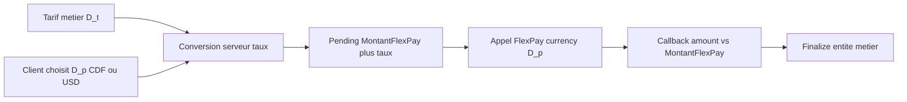
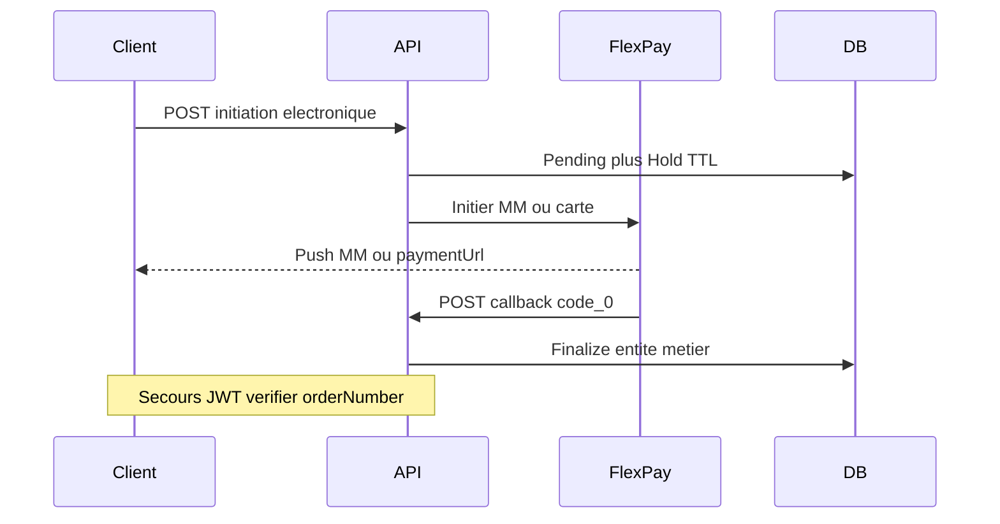

# Guide portable — Intégration FlexPay (paiement électronique)

Documentation **réutilisable** pour intégrer FlexPay (Mobile Money + carte bancaire) dans **une autre API**, en s’appuyant sur l’implémentation ProsocAPI.

**Dernière mise à jour** : juillet 2026  
**Sources** : code Prosoc (`Services/FlexPay*`, `Models/Configuration/FlexPayOptions.cs`) ; historique [Integration-FlexPay-From-RusaTravelAPI.md](../Integration-FlexPay-From-RusaTravelAPI.md)

---

## 1. Résumé exécutif

| Élément | Valeur |
|---------|--------|
| Prestataire | FlexPay (RDC) — Mobile Money, Visa/Mastercard |
| Méthodes électroniques | `MOBILE_MONEY`, `CARTE_BANCAIRE` uniquement |
| Modes hors FlexPay | ESPECE / VIREMENT / CHEQUE / etc. — **endpoint / service séparés** |
| Confirmation | Callback HTTPS public `POST …/callback` avec `code == "0"` |
| Secours | `GET …/verifier/{orderNumber}` (JWT recommandé) |
| Règle métier clé | **Créer l’entité métier seulement après callback succès** |
| Attente | Entité « en attente » + hold TTL (défaut 15 min) |
| Devises FlexPay | `CDF` ou `USD` uniquement (choix client → conversion serveur) |
| Paiement | **Intégral** (montant recalculé serveur ; tolérance configurable) |

### Démarrage rapide (autre projet)

1. Configurer `FlexPay` dans `appsettings` + credentials marchand (DB ou secrets).
2. Porter le client HTTP (`FlexPayService`) : MM, carte, check.
3. Créer le schéma minimal : pending + transaction + callback + hold (+ colonnes montant/devise/taux).
4. Exposer un callback **HTTPS public** accessible depuis Internet.
5. Séparer strictement **CASH / sync** et **électronique / async**.
6. Brancher le **choix de devise de paiement** (`CDF` / `USD`) + conversion tarif → FlexPay (voir [§3](#3-choix-de-devise-de-paiement-portable)).
7. Tester : initiation → callback `code=0` → idempotence (double callback) ; paiement CDF et USD.

---

## 2. Les trois couches (ne pas les mélanger)

| Couche | Portable ? | Contenu | Exemple devise |
|--------|------------|---------|----------------|
| **A. Contrat FlexPay (prestataire)** | Oui | URLs, payloads, codes, devises | `currency`: `CDF` ou `USD` uniquement |
| **B. Pattern d’intégration** | Oui | hold → pending → conversion → callback → finalize + idempotence | Client choisit `D_p` ; serveur calcule `MontantFlexPay` |
| **C. Métier de votre domaine** | Non | Remplacer la « commande » / adhésion / collecte Prosoc | Tarif métier en `D_t` (EUR, CDF, …) |

Ce qui se porte **presque tel quel** : client HTTP FlexPay, options, tables d’audit, callback + check montant + **conversion multi-devise avant l’appel prestataire**.

Ce qui **doit être réécrit** : le finalizer métier (créer l’ordre / billet / adhésion après `code=0`) et la résolution du **tarif** dans votre domaine.

---

## 3. Choix de devise de paiement (portable)

### 3.1 Intention

Le métier facture un montant dans une **devise tarif** `D_t`.  
Le payeur choisit une **devise de paiement** `D_p` ∈ {`CDF`, `USD`} — typiquement celle dans laquelle son **compte Mobile Money ou sa carte** dispose d’un solde suffisant.  
L’API convertit **côté serveur** `montant_tarif (D_t)` → `montant_FlexPay (D_p)`, puis envoie ce montant à FlexPay.



### 3.2 Ce que ce n’est **pas**

| Idée | Portable FlexPay ? | Commentaire |
|------|--------------------|-------------|
| Le payeur choisit CDF/USD selon **son** solde MM/carte | **Oui** — c’est le pattern | UX : proposer les deux devises ; le solde réel est chez l’opérateur / la banque |
| Router vers un **compte marchand** selon la devise ou un solde marchand | **Non** (hors pattern Prosoc) | Un token / code marchand suffit ; pas de multi-comptes par devise dans le guide |
| Débiter un **wallet virtuel agent** / caisse interne | **Non** — métier Prosoc | Flux sync (`VIRTUAL_ACCOUNT`, ESPECE) séparés de FlexPay |

### 3.3 Règles strictes

1. FlexPay n’accepte que **`CDF`** et **`USD`** (`currency` dans le payload).
2. Format `amount` : **entier** pour CDF ; **décimal** accepté pour USD.
3. **Ne jamais faire confiance** au montant client : recalculer depuis le tarif serveur + taux actif.
4. Si `D_t == D_p` → `MontantFlexPay = MontantTarif`, `TauxApplique = 1`.
5. Sinon → convertir via votre service de change ; arrondir (recommandé : 2 décimales `AwayFromZero`, puis **0 décimale** si `D_p = CDF`).
6. Persister sur le **pending** (obligatoire pour audit + callback) :

| Champ pending | Rôle |
|---------------|------|
| `MontantTarif` | Montant métier recalculé |
| `DeviseTarifId` / code tarif | Devise du pricing |
| `MontantFlexPay` | Montant réellement envoyé à FlexPay |
| `CodeDevisePaiement` | `CDF` ou `USD` |
| `TauxApplique` | Taux utilisé pour `D_t` → `D_p` |

7. Au callback : comparer `amount` reçu à `MontantFlexPay` (± `MontantTolerance`) ; journaliser `currency` du callback.

### 3.4 Contrat d’initiation générique (votre API)

**Requête (minimal)** :

```json
{
  "modePaiement": "MOBILE_MONEY",
  "telephonePaiement": "243900000000",
  "devisePaiementCode": "USD",
  "commande": { }
}
```

| Champ | Règle |
|-------|--------|
| `modePaiement` | `MOBILE_MONEY` ou `CARTE_BANCAIRE` |
| `telephonePaiement` | Obligatoire pour MM |
| `devisePaiementCode` | `CDF` ou `USD` (ou `devisePaiementId` mappé vers ces codes) |
| `commande` | Snapshot métier **votre** domaine (sérialisé dans le pending) |

Variante Prosoc : `devisePaiementId` (FK) + cohérence avec la devise des lignes métier du payload.

**Réponse (minimal)** — mêmes champs que [§8.1](#81-initiation-métier-électronique) ; essentiels :

```json
{
  "montantFlexPay": 25.00,
  "codeDevisePaiement": "USD",
  "tauxApplique": 0.00035,
  "orderNumberFlexPay": "FP...",
  "paymentUrl": null
}
```

Le front affiche clairement : « Vous allez payer **25,00 USD** » (montant **serveur**, pas celui saisi librement).

### 3.5 Ce que l’API cible doit fournir

| Composant | Rôle |
|-----------|------|
| Catalogue devises | Au moins `CDF` / `USD` avec codes ISO alignés FlexPay |
| Table / service de **taux de change** | Direct ou inverse ; date d’effet ; rejet si taux absent |
| Mapping | `devisePaiementId` ou code métier → `CDF` / `USD` |
| UX | Sélecteur « Payer en CDF » / « Payer en USD » avant initiation |
| Pending | Colonnes montant/devise/taux ci-dessus |

Algorithme de conversion (portable) :

```text
montantTarif, deviseTarif ← pricing serveur
devisePaiement ← choix client (CDF|USD uniquement)

si deviseTarif == devisePaiement:
    montantFlexPay ← montantTarif
    taux ← 1
sinon:
    (montantFlexPay, taux) ← Convertir(montantTarif, deviseTarif → devisePaiement)
si devisePaiement == CDF:
    montantFlexPay ← Round(montantFlexPay, 0)

persister pending ; appeler FlexPay(amount=montantFlexPay, currency=devisePaiement)
```

### 3.6 Hors scope de ce pattern

- Wallet virtuel agent, commissions, sessions caisse (Prosoc)
- Paiement partiel FlexPay (le pattern assume un paiement **intégral**)
- Règles d’éligibilité métier (adhésion, stock, sièges, …) — couche **C** uniquement

Référence code Prosoc (conversion) : `Services/DeviseConversionService.cs`, initiation `Services/FlexPayCollecteService.cs` / `FlexPayAdhesionService.cs`.

---

## 4. Architecture générique



### Couches techniques recommandées

| Couche | Rôle générique | Équivalent Prosoc |
|--------|----------------|-------------------|
| HTTP client | Appels MM / carte / check | `FlexPayService` |
| Initiation | Persist pending + hold + call FlexPay | `FlexPayCollecteService`, `FlexPayAdhesionService` |
| Callback | Audit, idempotence, branchement finalizer | `FlexPayCallbackService` |
| Finalizer | Créer l’entité métier | `FlexPayFinalizationService` |
| Marchand | Token + flags MM/carte | `InfoPaiementMarchand` |
| UX temps réel (optionnel) | SignalR / SSE / polling | `FlexPayHub` |

---

## 5. API FlexPay externe (prestataire)

### 5.1 URLs (défauts Prosoc)

| Usage | URL |
|-------|-----|
| Mobile Money | `https://backend.flexpay.cd/api/rest/v1/paymentService` |
| Carte v1.1 | `https://cardpayment.flexpay.cd/v1.1/pay` |
| Vérification | `https://apicheck.flexpaie.com/api/rest/v1/check/{orderNumber}` |

Header sortant : `Authorization: Bearer {apiToken}` (token marchand FlexPay).

### 5.2 Mobile Money — corps envoyé

```json
{
  "merchant": "CODE_MARCHAND",
  "type": "1",
  "reference": "PS-abc123...",
  "phone": "243900000000",
  "amount": "71250",
  "currency": "CDF",
  "callbackUrl": "https://votre-api.example/api/FlexPay/callback",
  "return_url": "https://votre-api.example/api/FlexPay/callback"
}
```

| Champ | Règle |
|-------|--------|
| `type` | `"1"` = Mobile Money |
| `amount` | **Entier** pour CDF ; décimal pour USD |
| `phone` | Obligatoire (format opérateur RDC) |
| Auth | Header Bearer |

### 5.3 Carte bancaire v1.1 — corps envoyé

```json
{
  "authorization": "Bearer {token}",
  "merchant": "CODE_MARCHAND",
  "reference": "PS-abc123...",
  "amount": 25,
  "currency": "USD",
  "description": "Paiement commande 42",
  "callback_url": "https://.../api/FlexPay/callback",
  "approve_url": "https://.../api/FlexPay/approve",
  "cancel_url": "https://.../api/FlexPay/cancel",
  "decline_url": "https://.../api/FlexPay/decline"
}
```

| Aspect | Mobile Money | Carte |
|--------|--------------|-------|
| Type interne | `"1"` | `"2"` |
| Téléphone | Obligatoire | Non requis |
| Réponse initiation | Push opérateur | **`paymentUrl`** à ouvrir dans le navigateur |
| Pages approve/cancel/decline | — | Informatives uniquement (ne finalisent pas) |

### 5.4 Réponse initiation FlexPay

```json
{
  "code": "0",
  "message": "...",
  "orderNumber": "FP123456789",
  "paymentUrl": "https://..."
}
```

- Succès côté initiation FlexPay : `code == "0"`.
- URLs de paiement possibles : `paymentUrl` | `redirectUrl` | `url` (résoudre dans cet ordre).

### 5.5 Callback FlexPay (entrant)

```json
{
  "code": "0",
  "reference": "PS-abc123...",
  "providerReference": "REF-OPERATEUR",
  "orderNumber": "FP123456789",
  "amount": "71250",
  "amountCustomer": "71250",
  "phone": "243900000000",
  "currency": "CDF",
  "createdAt": "...",
  "channel": "..."
}
```

| `code` | Action |
|--------|--------|
| `"0"` | Paiement OK → finaliser l’entité métier |
| autre | Refus → marquer pending en échec, libérer le hold |

### 5.6 Check transaction (secours)

`GET {CheckTransactionUrl}/{orderNumber}` + Bearer.

Succès si `transaction.status == "0"` ou `code == "0"` → réutiliser la même logique que le callback (synthétique).

---

## 6. Configuration

Section `appsettings` (miroir Prosoc [`FlexPayOptions`](../Models/Configuration/FlexPayOptions.cs)) :

```json
"FlexPay": {
  "Enabled": true,
  "HoldMinutes": 15,
  "CallbackBaseUrl": "https://votre-api.example/api/FlexPay/callback",
  "MobileMoneyUrl": "https://backend.flexpay.cd/api/rest/v1/paymentService",
  "CardPaymentUrl": "https://cardpayment.flexpay.cd/v1.1/pay",
  "CheckTransactionUrl": "https://apicheck.flexpaie.com/api/rest/v1/check",
  "ForceProductionCallbackInDev": false,
  "MontantTolerance": 0.05
}
```

| Clé | Rôle |
|-----|------|
| `CallbackBaseUrl` | URL publique HTTPS (accessible depuis Internet FlexPay) |
| `HoldMinutes` | TTL anti-doublon / expiration pending |
| `MontantTolerance` | Écart max callback vs montant attendu |
| Credentials marchand | **Hors appsettings** (table / vault) : `CodeMarchand` + `ApiToken` + flags MM/carte |

---

## 7. Modèle de données minimal

### Entités à prévoir dans toute API cible

| Entité | Rôle |
|--------|------|
| **Pending** (commande / paiement en attente) | Snapshot métier JSON + montants/devises/taux + `orderNumber` + statut + IDs finalisés |
| **TransactionFlexPay** | Trace de l’appel FlexPay (order, reference, type 1/2, callbacks count) |
| **CallbackFlexPay** | Audit de chaque webhook (payload, headers, IP) |
| **Hold** | Anti-doublon pendant TTL (clé téléphone / ressource / user) |
| **Marchand** | Token API + `actifMobileMoney` / `actifCarteBancaire` |
| **Taux de change** (ou service) | Conversion `D_t` → `D_p` avant l’appel FlexPay |

### Statuts pending recommandés

| Statut | Signification |
|--------|---------------|
| `EnAttente` | Paiement lancé |
| `Finalise` | Entité métier créée |
| `Echec` | Callback `code != "0"` |
| `Expire` | Hold / TTL dépassé sans succès |

### Colonnes d’idempotence et multi-devise sur le pending

- `IdXxxFinalise` (nullable) — si renseigné → second callback = succès idempotent
- `OrderNumberFlexPay` / `ReferenceFlexPay`
- `MontantTarif` + `DeviseTarifId` (ou code tarif)
- `MontantFlexPay` + `CodeDevisePaiement` (`CDF` / `USD`)
- `TauxApplique` (taux `D_t` → `D_p` au moment de l’initiation)

Migrations Prosoc de référence : `20260524224948_AddFlexPayModule`, `20260524230232_AddFlexPayAdhesionFinalisee`.

---

## 8. Contrats API de **votre** côté

### 8.1 Initiation (métier électronique)

1. Valider que le mode est FlexPay (`MOBILE_MONEY` / `CARTE_BANCAIRE`).
2. Valider `devisePaiement` ∈ {`CDF`, `USD`} (voir [§3](#3-choix-de-devise-de-paiement-portable)).
3. Recalculer le **tarif** côté serveur ; convertir vers `MontantFlexPay` / `CodeDevisePaiement` (ne jamais faire confiance au montant client).
4. Créer hold + pending (snapshot métier + montants/devises/taux).
5. Appeler FlexPay ; stocker `orderNumber`.
6. Répondre au client (typiquement `200` ou `202`) avec au minimum :

```json
{
  "idPending": "guid...",
  "orderNumberFlexPay": "FP...",
  "referenceFlexPay": "PS-...",
  "montantFlexPay": 1500,
  "codeDevisePaiement": "CDF",
  "tauxApplique": 1,
  "holdExpireAt": "2026-07-14T12:00:00Z",
  "paymentUrl": null,
  "flexPayAccepted": true,
  "message": "..."
}
```

Pour la carte : `paymentUrl` non null → redirection navigateur.

### 8.2 Callback public

```http
POST /api/FlexPay/callback
Content-Type: application/json
```

- **Sans JWT** (`[AllowAnonymous]`) — FlexPay n’envoie pas de token applicatif.
- Persister l’audit **avant** le traitement métier.
- Pipeline : retrouver transaction/pending → si déjà finalisé → OK idempotent → si `code != "0"` → échec → si `code == "0"` → check montant → finalizer.

Réponse HTTP 200 même en cas de refus métier géré (pour éviter les retries interminables FlexPay) ; distinguer dans le corps `success` / `alreadyProcessed` / message.

### 8.3 Vérifier (secours)

```http
GET /api/FlexPay/verifier/{orderNumber}
Authorization: Bearer {jwt}
```

Appelle l’API check FlexPay puis réutilise `ProcessCallback`.

### 8.4 Pages retour carte (optionnel)

`GET /approve|cancel|decline` — **informatifs seulement**. La création métier reste sur le callback `code=0`.

---

## 9. Règles d’idempotence et montant

| Règle | Pourquoi |
|-------|----------|
| Finalizer une seule fois | FlexPay peut renvoyer 2× le même callback |
| Si `IdFinalise` déjà set → `AlreadyProcessed = true` | Pas de double commande / double collecte |
| Comparer montant callback vs `MontantFlexPay` (± `MontantTolerance`) | Anti-fraude basique |
| Libérer le hold sur échec / expire | Débloquer une nouvelle tentative |
| Incrémenter `NombreCallbacks` | Observabilité / support |

### Séparation CASH / électronique

| Flux | Comportement |
|------|--------------|
| CASH / sync | Création immédiate des entités ; **interdire** MM/carte |
| Électronique | **Interdire** ESPECE etc. ; ne créer qu’au callback |

Helper Prosoc : [`Helpers/MethodePaiementHelper.cs`](../Helpers/MethodePaiementHelper.cs) (`IsFlexPay`, alias `ORANGE_MONEY` → `MOBILE_MONEY`, `CARD` → `CARTE_BANCAIRE`).

---

## 10. Sécurité du callback

Dans Prosoc, le callback est public **sans HMAC / signature**.

**Minimum obligatoire** pour une nouvelle API :

1. HTTPS + `CallbackBaseUrl` fixe et connu
2. Contrôle montant + devise
3. Idempotence stricte
4. Audit payload / IP / headers

**Durcissement recommandé** (si le contexte le permet) :

- Allowlist IP FlexPay (demander la liste au prestataire)
- Rate limiting sur `/callback`
- Ne pas exposer d’IDs métier secrets dans `reference` si possible
- SignalR / groupes publics : le GUID pending joue le rôle de secret faible

---

## 11. Checklist de portage vers votre API

Remplacez mentalement *Commande* / *Réservation* / *Adhésion* par votre agrégat.

- [ ] Section `FlexPay` + client HTTP dédié (`AddHttpClient("FlexPay")`)
- [ ] Table / store marchand (token jamais renvoyé en clair dans les API admin)
- [ ] Entité pending + hold TTL
- [ ] Tables `TransactionFlexPay` / `CallbackFlexPay` (audit)
- [ ] Endpoint initiation électronique séparé du flux CASH
- [ ] `POST /callback` HTTPS public + pipeline idempotent
- [ ] `GET /verifier/{orderNumber}` (JWT)
- [ ] Finalizer = **uniquement** votre création métier après `code=0`
- [ ] Alias modes de paiement normalisés
- [ ] **Multi-devise** :
  - [ ] UX : choix explicite `CDF` / `USD` (solde côté payeur MM/carte)
  - [ ] Taux de change présents (direct ou inverse) pour `D_t` → `D_p`
  - [ ] Conversion **avant** l’appel FlexPay ; rejet si taux manquant
  - [ ] Arrondi CDF à l’entier ; USD avec décimales
  - [ ] Pending : `MontantTarif`, `DeviseTarif`, `MontantFlexPay`, `CodeDevisePaiement`, `TauxApplique`
  - [ ] Callback : contrôle `amount` vs `MontantFlexPay` (± tolérance) ; journaliser `currency`
- [ ] Tests : succès, refus, double callback, écart de montant, **initiation CDF et USD**
- [ ] (Optionnel) temps réel SignalR / SSE ; sinon polling `verifier`

### Ce qu’il ne faut **pas** porter tel quel depuis Prosoc

| Spécifique Prosoc | Remplacer par |
|-------------------|---------------|
| `CollecteEnAttente` + 4 `SourceFlux` | Votre pending + enum de flux |
| Finalization adhésion / collecte / caisse | Votre `FinalizeOrderAsync` |
| `InfoPaiementMarchand` org-unique | 1 marchand / tenant / site selon votre modèle |
| SignalR `FlexPayHub` | Optionnel |
| Règles tarif cotisation / type adhésion | Votre pricing |
| Wallet virtuel agent / `VIRTUAL_ACCOUNT` | Hors FlexPay (flux sync métier) |

---

## 12. Annexe Prosoc (exemple d’adaptation)

> Cette section décrit **comment Prosoc applique** le pattern. Elle n’est pas un contrat obligatoire pour une autre API.

### 12.1 Flux métier Prosoc (`CollecteEnAttenteSourceFlux`)

| Source | Endpoint | Auth | HTTP | Préfixe ref. | Finalisation |
|--------|----------|------|------|--------------|--------------|
| `CollecteAgent` | `POST /api/Collecte` | JWT | `200` | `PS-` | Collecte agent |
| `CollectePaiementElectroniquePublic` | `POST /api/Collecte/with-paiement-electronique` | Anon | `202` | `PS-` | Collecte publique |
| `PaiementAffilie` | `POST /api/Affilie/paiement` | JWT affilié | `200` | `PS-` | Paiement affilié |
| `AdhesionWithAffilie` | `POST /api/Adhesion/with-affilie-paiement-electronique` | Anon | `202` | `AD-` | Adhésion + collectes |
| `SouscriptionAchatPaiementElectronique` | `POST /api/SouscriptionPrestation/paiement-electronique` | JWT | `202` | `SP-` | Nouvelle souscription + collecte |

Règle commune : **aucune** ligne `Collecte` / `Adhesion` / `SouscriptionPrestation` (flux électroniques concernés) avant callback `code=0`. Statut paiement persisté à la création : `VALIDE`.

### 12.2 Endpoints FlexPay Prosoc

| Méthode | Route | Auth |
|---------|-------|------|
| `POST` | `/api/FlexPay/callback` | Anon |
| `GET` | `/api/FlexPay/verifier/{orderNumber}` | JWT |
| `GET` | `/api/FlexPay/approve\|cancel\|decline` | Anon (info) |
| CRUD | `/api/InfoPaiementMarchand` | Admin / Financier |

### 12.3 Fichiers source à lire en priorité

| Fichier | Rôle |
|---------|------|
| [`Services/FlexPayService.cs`](../Services/FlexPayService.cs) | Client HTTP prestataire |
| [`Services/FlexPayCallbackService.cs`](../Services/FlexPayCallbackService.cs) | Pipeline callback + vérif |
| [`Services/FlexPayFinalizationService.cs`](../Services/FlexPayFinalizationService.cs) | Création métier |
| [`Services/FlexPayCollecteService.cs`](../Services/FlexPayCollecteService.cs) | Initiation collecte |
| [`Services/FlexPayAdhesionService.cs`](../Services/FlexPayAdhesionService.cs) | Initiation adhésion |
| [`Services/DeviseConversionService.cs`](../Services/DeviseConversionService.cs) | Conversion multi-devise (tarif → paiement) |
| [`Controllers/FlexPayController.cs`](../Controllers/FlexPayController.cs) | Routes callback / verifier |
| [`Models/Configuration/FlexPayOptions.cs`](../Models/Configuration/FlexPayOptions.cs) | Config |
| [`Models/DTOs/FlexPay/FlexPayDtos.cs`](../Models/DTOs/FlexPay/FlexPayDtos.cs) | Contrats DTO |
| [`Helpers/MethodePaiementHelper.cs`](../Helpers/MethodePaiementHelper.cs) | CASH vs FlexPay |
| [`Helpers/FlexPayUrlHelper.cs`](../Helpers/FlexPayUrlHelper.cs) | Résolution URLs callback / retour |

### 12.4 Différences vs guide RusaTravel

| Sujet | RusaTravel (doc historique) | Prosoc |
|-------|----------------------------|--------|
| Pending | `CommandeReservationEnAttente` + holds sièges | `CollecteEnAttente` |
| Marchand | 1 config **par site** | 1 config **active** organisation |
| Métier après paiement | Réservation + billets | Collecte et/ou Adhésion |
| Temps réel | selon front | SignalR `/flexPayHub` |

Doc historique : [Integration-FlexPay-From-RusaTravelAPI.md](../Integration-FlexPay-From-RusaTravelAPI.md) (certains liens internes y sont cassés / hors repo).

### 12.5 Documentation Prosoc complémentaire

| Document | Contenu |
|----------|---------|
| [API-DOCUMENTATION-NEW.md](../API-DOCUMENTATION-NEW.md) — section FlexPay | Endpoints, config, SignalR, MM vs carte |
| [FRONTEND_INTEGRATION_ADHESION_FLEXPAY.md](../FRONTEND_INTEGRATION_ADHESION_FLEXPAY.md) | Front adhésion électronique |
| [FRONTEND_INTEGRATION_COLLECTE_FLEXPAY.md](../FRONTEND_INTEGRATION_COLLECTE_FLEXPAY.md) | Front collecte électronique |
| [PROCESSUS_ADHESION_EN_LIGNE_ET_AFFECTATION_AGENT.md](../PROCESSUS_ADHESION_EN_LIGNE_ET_AFFECTATION_AGENT.md) | Métier adhésion en ligne post-paiement |

### 12.6 Tests Prosoc utiles comme modèles

- `Prosoc.Tests.Integration/FlexPay/FlexPayCallbackIntegrationTests.cs`
- `Prosoc.Tests.Integration/FlexPay/FlexPayStubService.cs`
- `Prosoc.Tests.Unit/Helpers/FlexPayUrlHelperTests.cs`

---

## 13. Glossaire

| Terme | Définition |
|-------|------------|
| **Pending** | Enregistrement d’un paiement électronique non encore confirmé |
| **Hold** | Verrou temporaire anti-doublon pendant TTL |
| **orderNumber** | Identifiant FlexPay de la transaction |
| **reference** | Identifiant métier envoyé à FlexPay (préfixe libre : `PS-`, `AD-`, …) |
| **Devise tarif (`D_t`)** | Devise du pricing métier (recalculée serveur) |
| **Devise paiement (`D_p`)** | Devise choisie par le payeur pour FlexPay (`CDF` ou `USD`) |
| **MontantFlexPay** | Montant converti envoyé à FlexPay (et contrôlé au callback) |
| **Finalize** | Création des entités métier après `code=0` |
| **Idempotence** | Deux callbacks identiques → une seule création métier |

---

## 14. Checklist de validation (recette)

1. Config marchand active + flags MM / carte.
2. Initiation MM → push reçu → callback `code=0` → entité créée une fois.
3. Double callback → `alreadyProcessed`, pas de second enregistrement.
4. Callback `code=1` → pending en échec, hold libéré, pas d’entité.
5. Écart montant hors tolérance → rejet / pas de finalisation.
6. Carte → `paymentUrl` → pages approve informatives → finalisation seulement au callback.
7. `verifier/{orderNumber}` finalise si FlexPay dit payé et pending encore ouvert.
8. Flux CASH refuse MM/carte ; flux électronique refuse ESPECE.
9. Initiation en **CDF** et en **USD** (taux présent ; montant FlexPay cohérent ; callback `currency` aligné).
10. UX : le montant affiché au payeur = `montantFlexPay` renvoyé par l’API (pas un montant libre client).
